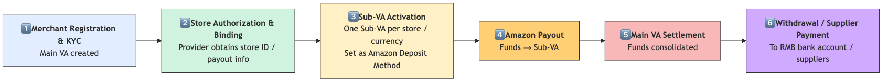
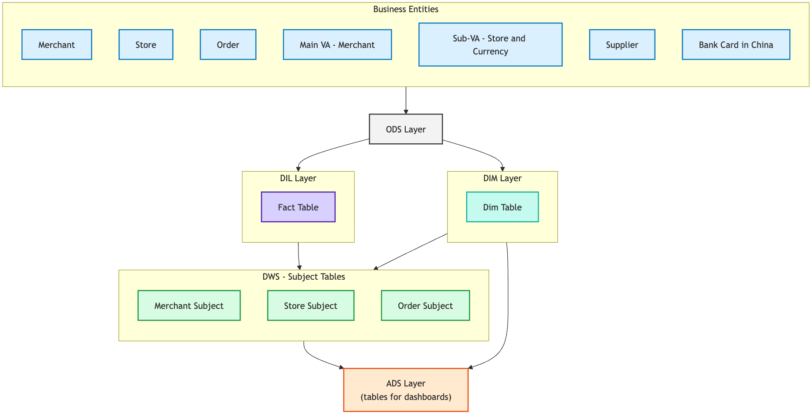

## 1. Data Warehouse Architecture – Hourglass Model

We follow a **<mark>business-driven layered architecture</mark>**:

👉 **<mark>ODS → DIL/DIM → DWS → ADS</mark>**

  

* **ODS (Operational Data Store):** Ingest **<mark>raw data</mark>** (e.g., binlog subscription, hourly batch).
* **DIL/DIM (Integration Layer):** **<mark>Clean, deduplicate, normalize</mark>**; build **<mark>fact</mark>** and **<mark>dimension tables</mark>**.
* **DWS (Warehouse Service):** Model around **<mark>business entities & processes</mark>** (Merchant, Store, Order, Settlement), delivering **<mark>subject-oriented wide tables</mark>**.
* **ADS (Application Layer):** Serve **<mark>BI, dashboards</mark>**.

**Development Process**

1. Define **<mark>business goals & requirements</mark>**
2. Load raw data → **<mark>ODS</mark>**
3. Transform into **<mark>fact/dim</mark>** → **<mark>DIL/DIM</mark>**
4. Aggregate by **<mark>subject themes</mark>** → **<mark>DWS</mark>**
5. Serve **<mark>reporting & BI</mark>** → **<mark>ADS</mark>**

## 2. Business Case 1 – Cross-border E-commerce Collection (Amazon Standard Collection)

### 🔹 Background

* Chinese/HK cross-border sellers operate **<mark>multiple Amazon stores</mark>** across countries.
* Sellers cannot easily open overseas bank accounts → struggle with **<mark>receiving funds, withdrawing, paying suppliers</mark>**.

### 🔹 Solution (VA Model)

* L1 - Payment Providers offer an **<mark>offshore Logical Main VA</mark>**（merchant-level ledger）
* L2 - Each **<mark>store</mark>** is assigned a **<mark>Sub-VA</mark>** (virtual ledger accounts, mapped to a Main VA).
* The system automatically aggregates **<mark>Sub-VA balances</mark>** into the **<mark>Main VA</mark>**, ensuring transaction-level traceability and regulatory compliance.
 
### 🔹 Business Process

  

## 3. Data Warehouse How to Built

  

