## 1. Data Warehouse Architecture – Hourglass Model

We follow a **<mark>business-driven layered architecture</mark>**:

👉 **<mark>ODS → DIL/DIM → DWS → ADS</mark>**

  

* **ODS (Operational Data Store):** Ingest **<mark>raw data</mark>** (e.g., binlog subscription, hourly batch).
* **DIL/DIM (Integration Layer):** **<mark>Clean, deduplicate, normalize</mark>**; build **<mark>fact</mark>** and **<mark>dimension tables</mark>**.
* **DWS (Warehouse Service):** Model around **<mark>business entities & processes</mark>** (Merchant, Store, Order, Settlement), delivering **<mark>subject-oriented wide tables</mark>**.
* **ADS (Application Layer):** Serve **<mark>BI, dashboards</mark>**.

**Development Process**

1. Define **<mark>business goals & requirements</mark>**
2. Load raw data → **<mark>ODS</mark>**
3. Transform into **<mark>fact/dim</mark>** → **<mark>DIL/DIM</mark>**
4. Aggregate by **<mark>subject themes</mark>** → **<mark>DWS</mark>**
5. Serve **<mark>reporting & BI</mark>** → **<mark>ADS</mark>**

## 2. Business Case 1 – Cross-border E-commerce Collection (Amazon Standard Collection)

### 🔹 Background

* Chinese/HK cross-border sellers operate **<mark>multiple Amazon stores</mark>** across countries.
* Sellers cannot easily open overseas bank accounts → struggle with **<mark>receiving funds, withdrawing, paying suppliers</mark>**.

### 🔹 Solution (VA Model)

* L1 - Payment Providers offer an **<mark>offshore Logical Main VA</mark>**（merchant-level ledger）
* L2 - Each **<mark>store/currency</mark>** is assigned a **<mark>Sub-VA</mark>** (virtual ledger accounts (not real bank accounts), mapped to a Main VA).
* The system automatically aggregates **<mark>Sub-VA balances</mark>** into the **<mark>Main VA</mark>**, ensuring transaction-level traceability and regulatory compliance.
 

### 🔹 Business Process

```mermaid
flowchart LR
    A["1️⃣ **<mark>Merchant Registration & KYC</mark>**<br>Main VA created"]:::step1
    B["2️⃣ **<mark>Store Authorization & Binding</mark>**<br>Provider obtains store ID / payout info"]:::step2
    C["3️⃣ **<mark>Sub-VA Activation</mark>**<br>One Sub-VA per store / currency<br>Set as Amazon Deposit Method"]:::step3
    D["4️⃣ **<mark>Amazon Payout</mark>**<br>Funds → Sub-VA"]:::step4
    E["5️⃣ **<mark>Main VA Settlement</mark>**<br>Funds consolidated"]:::step5
    F["6️⃣ **<mark>Withdrawal / Supplier Payment</mark>**<br>To RMB bank account / suppliers"]:::step6

    A --> B --> C --> D --> E --> F

    classDef step1 fill:#e6f0ff,stroke:#333;
    classDef step2 fill:#d5f5e3,stroke:#333;
    classDef step3 fill:#fff2cc,stroke:#333;
    classDef step4 fill:#ffd580,stroke:#333;
    classDef step5 fill:#f9c0c0,stroke:#333;
    classDef step6 fill:#d5b3ff,stroke:#333;
```

👉 **Amazon pays → <mark>Sub-VA</mark> (store-level) → <mark>Main VA</mark> (aggregation & settlement) → <mark>Bank/Supplier payout</mark>**

## 3. Data Warehouse How to Built

