> 🛡️ **Disclaimer:**  
> The following content represents generalized industry knowledge and anonymized case practices.  
> It does **not contain any confidential, proprietary, or internal information** from any specific company.  
> The described models are **common industry practices** widely adopted by major cross-border payment providers (e.g., Ant/WorldFirst, LianLian, PingPong), and do not reflect any proprietary implementation details.

## 🎯 Data Warehouse Core Purpose

The **<mark>core purpose</mark>** of a Data Warehouse (DWH) is to **<mark>integrate and store data</mark>** from multiple sources, providing **<mark>accurate, reliable, and consistent data</mark>** for analysis, reporting, and decision-making.

It addresses:

* **<mark>Fragmentation</mark>** across systems
* Difficulty in **<mark>historical data management</mark>**
* Lack of **<mark>traceability and reliability</mark>** for compliance & BI

## 1. Data Warehouse Architecture – Hourglass Model

We follow a **<mark>business-driven layered architecture</mark>**:

👉 **<mark>ODS → DIL/DIM → DWS → ADS</mark>**

  

* **ODS (Operational Data Store):** Ingest **<mark>raw data</mark>** (e.g., binlog subscription, hourly batch).
* **DIL/DIM (Integration Layer):** **<mark>Clean, deduplicate, normalize</mark>**; build **<mark>fact</mark>** and **<mark>dimension tables</mark>**.
* **DWS (Warehouse Service):** Model around **<mark>business entities & processes</mark>** (Merchant, Store, Order, Settlement), delivering **<mark>subject-oriented wide tables</mark>**.
* **ADS (Application Layer):** Serve **<mark>BI, dashboards</mark>**.

**Development Process**

1. Define **<mark>business goals & requirements</mark>**
2. Load raw data → **<mark>ODS</mark>**
3. Transform into **<mark>fact/dim</mark>** → **<mark>DIL/DIM</mark>**
4. Aggregate by **<mark>subject themes</mark>** → **<mark>DWS</mark>**
5. Serve **<mark>reporting & BI</mark>** → **<mark>ADS</mark>**

## 2. Business Case 1 – Cross-border E-commerce Collection (Amazon Standard Collection)

### 🔹 Background

* Chinese/HK cross-border sellers operate **<mark>multiple Amazon stores</mark>** across countries.
* Sellers cannot easily open overseas bank accounts → struggle with **<mark>receiving funds, withdrawing, paying suppliers</mark>**.

### 🔹 Solution (VA Model)

* Providers (Ant/WorldFirst, Tenpay, LianLian) offer an **<mark>offshore Main VA</mark>** (real bank account).
* Each **<mark>store/currency</mark>** is assigned a **<mark>Sub-VA</mark>** (virtual ledger accounts (not real bank accounts), mapped to a Main VA).
* The system automatically aggregates **<mark>Sub-VA balances</mark>** into the **<mark>Main VA</mark>**, ensuring transaction-level traceability and regulatory compliance.

### 🔹 Business Process

```mermaid
flowchart LR
    A["1️⃣ **<mark>Merchant Registration & KYC & VA Assignment</mark>**"]:::step1
    B["2️⃣ **<mark>Store Authorization & Binding</mark>**<br>Tenpay/LianLian can see the store-level payout information (store ID..) "]:::step2
    C["3️⃣ **<mark>Sub-VA Assigned</mark>**<br>(per store / currency)"]:::step3
    D["4️⃣ **<mark>Amazon Payout</mark>**<br>Funds → Sub-VA"]:::step4
    E["5️⃣ **<mark>Main VA Settlement</mark>**<br>Funds consolidated"]:::step5
    F["6️⃣ **<mark>Withdrawal / Supplier Payment</mark>**"]:::step6

    A --> B --> C --> D --> E --> F

    classDef step1 fill:#e6f0ff,stroke:#333;
    classDef step2 fill:#d5f5e3,stroke:#333;
    classDef step3 fill:#fff2cc,stroke:#333;
    classDef step4 fill:#ffd580,stroke:#333;
    classDef step5 fill:#f9c0c0,stroke:#333;
    classDef step6 fill:#d5b3ff,stroke:#333;
```

👉 **Amazon pays → <mark>Sub-VA</mark> (store-level) → <mark>Main VA</mark> (aggregation & settlement) → <mark>Bank/Supplier payout</mark>**

## 3. Data Warehouse How to Built

## 4. Other - Shopee Official Wallet

> In Shopee’s official wallet model, Shopee itself acts as the settlement entity. After sellers onboard and bind stores, Shopee credits their **official wallet account** (white-label offshore account powered by Tenpay).  
There is **no sub-VA per store** — store-level differentiation comes from Shopee’s internal transaction system. Funds can be disbursed (fees, supplier payments, subscription plans) or withdrawn to bank accounts.  

| No. | Amazon Standard Collection   | Shopee Official Wallet   |
| --- | ---------------------------- | ------------------------- |
| 1   | **<mark>Merchant Onboarding</mark>**   Merchant registers & KYC   | **<mark>Merchant Onboarding</mark>**   Merchant registers & KYC     |
| 2   | **<mark>VA Assignment</mark>**   Main VA created (**no Sub-VA yet**)    | **<mark>Shop Binding</mark>**   Merchant links their stores   |
| 3   | **<mark>Store Authorization</mark>**   Grant API access; provider receives **seller/store IDs**    | **<mark>Funds Inflow (Top-up)</mark>**   Shopee credits merchant wallet  |
| 4   | **<mark>Store Binding & Sub-VA Assignment</mark>**   Provider **assigns/activates Sub-VA per store/currency** and sets **Deposit Method** to this Sub-VA | **<mark>Funds Flow & Deduction</mark>**   Payouts/deductions processed   |
| 5   | **<mark>Amazon Payout → Sub-VA</mark>**   Funds flow into store-level Sub-VA  | **<mark>Merchant Card Binding</mark>**   Bank card linked for withdrawal |
| 6   | **<mark>Merchant Card Binding</mark>**   Settlement card binding   | **<mark>Payout – Withdrawal/Payment</mark>**   Merchant withdraws/pays   |
| 7   | **<mark>Withdrawal & Payout</mark>**   From Main VA to bank/supplier | **<mark>Payout – Merchant Ops</mark>**   e.g., annual subscription plan  |

### Subject-Specifc Table (Standard Collection)

<strong style="color:#1E90FF;">Merchant Subject Sample - Data Metric</strong>

> Purpose: Merchant-level portrait & funnel — from registration → KYC → store binding → first settlement → cash-out/payment; includes horizontal attributes and longitudinal metrics/tags.

#### Partition & Keys

| Field       | Type   | Description                            | Source/Notes                                                                |
| ----------- | ------ | -------------------------------------- | -------------- |
| `fdate`     | BIGINT | Partition date     | Partition column                                                            |
| `fetl_time` | BIGINT | ETL timestamp   |                                                                             |
| `fgid`      | STRING | Merchant GID (created at registration) | business keys; `dil_evt_mer_login` |
| `fspid`     | STRING | Merchant ID | Maps to `fgid`; `dim_merchant_info`                     |

#### Merchant Basic Attributes (Horizontal)

| Field                       | Type   | Description                       | Source/Notes                                                           |
| ------------------- | ------ | ------------- | ------------------- |
| `fregister_channel_source`  | STRING | Registration channel (PC/H5/MP)   | Parse from operator JSON; `mer_operator` |

#### Key Time Funnel (Horizontal)

| Field                        | Type   | Description                  | Key Rules / Source                                     |
| ---------------------------- | ------ | ---------------------------- | ------------------------------------------------------ |
| `fcreate_time_enter`         | STRING | Entry/first seen time        | Login external ID integration                          |
| `fcreate_time_register`      | STRING | Registration time            |                                 |
| `fcreate_time_register_info` | STRING | Profile completion time      | From operator/approval trail                           |
| `fcreate_time_kyc_apply`     | STRING | KYC application time         |                         |
| `fcreate_time_kyc_info`      | STRING | KYC info completion time     |                               |
| `fcreate_time_kyc_reject`    | STRING | KYC rejection time           |                                               |
| `fcreate_time_store_apply`   | STRING | **Store apply** time         |                                         |
| `fcreate_time_store_auth`    | STRING | **Store authorization** time | Event `AUTH_SHOP_SUCCESS`                              |
| `fcreate_time_store_bind`    | STRING | **Store binding** time       | Event `AUDIT_SHOP_SUCCESS`                             |
| `ffirst_recharge_time`       | STRING | **First settlement** time    | Earliest in `dil_trd_recharge` |

> Optional milestones to add later: time when cumulative settlement reaches **10/100/500 USD**.

#### Longitudinal Metrics

| Field                           | Type   | Description                      | Notes                  |
| ------------------------------- | ------ | -------------------------------- | ---------------------- |
| `ftotal_recharge_amount_usd`    | DOUBLE | Cumulative settlement (USD)      | After    |
| `ftotal_recharge_amount_rmb`    | DOUBLE | Cumulative settlement (CNH)      | After    |
| `ftotal_recharge_cnt`           | BIGINT | Cumulative number of settlements | Distinct `Fbilling_id` |
| `flast_recharge_amount_usd_28d` | DOUBLE | Last 28-day settlement (USD)     | Activity       |
| `flast_recharge_amount_rmb_28d` | DOUBLE | Last 28-day settlement (CNH)     |                        |
| `flast_recharge_amount_cnt_28d` | BIGINT | Last 28-day settlement count     |                        |

#### Lifecycle & Tags

| Field                     | Type   | Description                         | Rule Highlights                                                      |
| ------------------------- | ------ | -------------------- | ----------------------------- |
| `fmerchant_lifecycle_tag` | BIGINT | Lifecycle tag                       | 1 No-funding / 2 New / 3 Retained / 4 Lost / 5 Recovered / 0 Default |

<strong style="color:#1E90FF;">Store Subject Sample - Data Metric</strong>

> Purpose: **Store** view (schema retains `shop_*` naming). Captures store attributes, key time funnel (apply → auth → bind → first settlement → first cash-out/payment), and activity/volume metrics.

#### Partition & Keys

| Field       | Type   | Description                | Notes                                        |
| ----------- | ------ | -------------------------- | -------------------------------------------- |
| `fdate`     | BIGINT | Partition date             |                                              |
| `fetl_time` | BIGINT | ETL timestamp              |                                              |
| `fshop_id`  | STRING | **Store ID** (primary key) | From `dim_shop_info` |
| `fspid`     | STRING | Merchant ID                |                                              |
| `fgid`      | STRING | Merchant GID               | Map via merchant dim                         |

#### Store Attributes (Horizontal, Try link from dim)

| Field                                                   | Type   | Description                          | Notes                                     |
| ----------------------------- | ------ | ------------------------------------ | ----------------------------------------- |
| `fplat_shop_id`   `fplat_shop_name`                                            | STRING | Store name                           |                                           |
| `fplatform_id`   `fsite_id`   `fcountry_id`   `fcur_type`                                         | STRING |       | Standard collection platforms             |

#### Key Time Funnel (Horizontal)

| Field                     | Type   | Description                   | Rule / Source                     |
| ------------------------- | ------ | ----------------------------- | --------------------------------- |
| `fcreate_time_shop_apply` | STRING | Store apply time              |                        |
| `fcreate_time_shop_auth`  | STRING | Store authorization time      | `AUTH_SHOP_SUCCESS`               |
| `fcreate_time_shop_bind`  | STRING | Store binding (approved)      | `AUDIT_SHOP_SUCCESS`              |
| `ffirst_recharge_time`    | STRING | First settlement time         | From recharge list                |
| `ffirst_withdrawal_time`  | STRING | First withdrawal/payment time | From coll order (your conditions) |

#### Metrics (Longitudinal)

| Field                           | Type   | Description                 | Notes         |
| ------------------------------- | ------ | --------------------------- | ------------- |
| `ftotal_recharge_amount_usd`    | DOUBLE | Cumulative settlement (USD) | FX conversion |
| `ftotal_recharge_amount_cnh`    | DOUBLE | Cumulative settlement (CNH) |               |
| `ftotal_recharge_cnt`           | BIGINT | Cumulative settlement count |               |
| `flast_recharge_amount_usd_28d` | DOUBLE | 28-day settlement (USD)     |               |
| `flast_recharge_amount_cnh_28d` | DOUBLE | 28-day settlement (CNH)     |               |
| `flast_recharge_amount_cnt_28d` | BIGINT | 28-day settlement count     |               |

#### Lifecycle & Tags

| Field                     | Type   | Description                | Rule Highlights                        |
| ------------------- | ------ | -------------------------- | ----------------- |
| `fmerchant_lifecycle_tag` | BIGINT | Store lifecycle tag        | No-funding/New/Retained/Lost/Recovered |

<strong style="color:#1E90FF;">Order Subject Sample - Data Metric</strong>

> Purpose: **Order-grain** view combining **inflow (settlement)** and **outflow (withdrawal/payment)** with consistent merchant/store dimensions, amounts, currencies, and time; supports funnels and distribution analysis.

#### Partition & Event Columns

| Field                | Type   | Description                           | Notes                               |
| -------------------- | ------ | ------------------------------------- | ----------------------------------- |
| `fdate`              | BIGINT | Partition date                        |                                     |
| `fetl_time`          | BIGINT | Extraction timestamp                  |                                     |
| `Ftransaction_scene` | BIGINT | 1 = Inflow (settlement) ; 2 = Outflow | Inflow branch sets `1`              |
| `Flistid`            | STRING | Order ID (primary key)                | Aligns across inflow/outflow tables |
| `Ftransaction_time`  | STRING | Transaction time                      | Inflow uses `Factual_entry_time`    |

#### Merchant / Store Dimensions

| Field      | Type   | Description  | Notes                                        |
| ---------- | ------ | ------------ | -------------------------------------------- |
| `fgid`     | STRING | Merchant GID | From merchant dim                            |
| `fspid`    | STRING | Merchant ID  |                                              |
| `fshop_id` | STRING | **Store ID** | In inflow |

#### Amounts & Currencies

| Field                     | Type   | Description                | Notes                            |
| ------------------------- | ------ | -------------------------- | -------------------------------- |
| `Ftransaction_cur_type`   | STRING |   | Map from numeric; handle 156→CNH |
| `Ftransaction_amount`     | DOUBLE | Amount (original currency) |                  |
| `Ftransaction_amount_usd` | DOUBLE | Amount (USD)               | FX table;         |
| `Ftransaction_amount_cnh` | DOUBLE | Amount (CNH)               | FX table                         |

#### Outflow-only Fields (NULL for inflow)

| Field         | Type   | Description         | Notes                                       |
| ------------- | ------ | ------------------- | ------------------------------------------- |
| `fbuy_type`   | STRING | Buy/credit currency | From `Fbuy_cur_type`                        |
| `fpayee_id`   | STRING | Payee ID            | For withdrawals/payments                    |
| `fpayee_type` | BIGINT | Payee type          | Your enum rules                             |
| `fsell_type`  | STRING | Sell currency       | Payment scene                               |

#### Payee Other Info

| Field                    | Type   | Description                                    | Notes                     |
| ------------------------ | ------ | ---------------------------------------------- | ------------------------- |
| `fcompany_subject_type`  | BIGINT | Legal entity type (enterprise/natural person…) | From merchant dim         |
| `transaction_category`   | BIGINT | 1 Withdrawal / 2 Supplier Payment / 3 VAT      | Derive via your SQL rules |
| `payee_account_category` | BIGINT | 1 Same-name bank / 2 Wallet / …                | Requires payee dim joins  |

