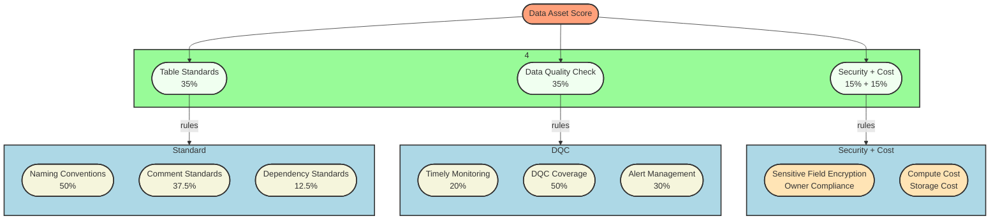
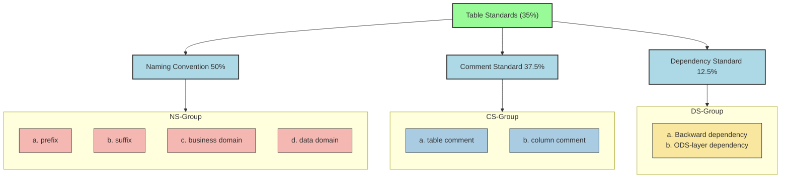
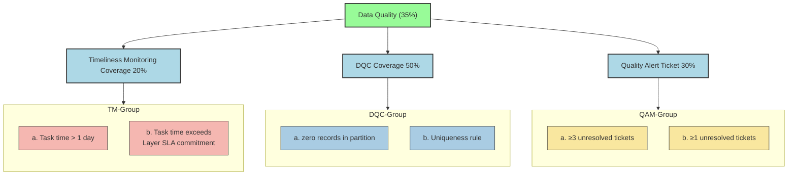
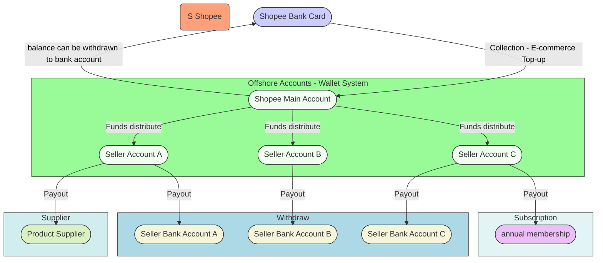
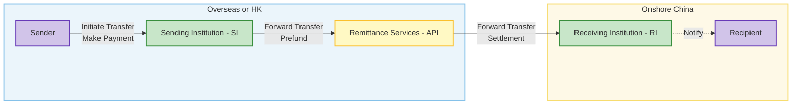

# Data Warehouse

The core purpose of a data warehouse is to integrate and store large amounts of internal and external data, providing accurate, reliable data for analysis, reporting, and decision-making, while addressing issues like **fragmentation**, and difficult historical data management.

## Q1. Data Warehouse Architecture - Hourglass

Built a layered data warehouse (ODS > DIL > DML > DAL) to ingest, clean, and transform data into fact and dimension tables. Defined data domains, granularity, metrics, and embedded business logic for subject-oriented, multi-dimensional analysis

  

## Q2. How is your data warehouse built?

### 1. Architecture

We follow a **business-driven layered architecture**: **ODS → DIL/DIM → DWS → ADS**.

- **ODS**: Ingest raw data via binlog subscription with hourly batch loading.  
- **DIL/DIM**: Clean, deduplicate, and normalize data; build fact and dimension tables.  
- **DML (Data Mart Layer)**: Perform <mark>subject-oriented</mark> modeling around <mark>business entities</mark> (e.g., Merchant, Order) and processes (e.g., Top-up, settlement, payment/withdrawal), delivering reusable wide tables and standardized metrics for **<mark>multi-dimensional and thematic analysis.</mark>**
- **ADS (Application Data Service Layer)**: Deliver application-level wide tables to support Finance, Risk, and BI reporting.  

### 2. Modeling

#### Business Case 1 – Cross-border E-commerce Collection

- **Process-oriented**: Model fact tables around fund flow processes:  
  *Top-up → Distribution → Withdrawal/Payment/Subscription.*  
- **Entity-oriented**: Build subject tables around merchants, shops, and orders.  
  Design metrics to enable multi-dimensional analysis, subject-area analytics, and monitoring of core business KPIs.  

#### Business Case 2 – Cross-border Remittances

- **Process-oriented**: Model fact tables around the remittance lifecycle:  
  *Sender initiates transfer → Remittance → Recipient account setup → Recipient collects funds.*  
- **Entity-oriented**: Build subject tables around sending institutions, remittance orders (3 lifecycle stages), recipients, and senders.  
  Design metrics to support funnel analysis, compliance monitoring, and business insights.  

### 3. Governance

- **Data Asset Scoring**: Evaluate each table across four dimensions: standards, data quality (DQC), security, and cost.  
- **Data Quality Monitoring (DQC)**: Enforce rules for completeness, uniqueness, timeliness, and reconciliation.  
- **Security & Compliance**: Detect unencrypted sensitive fields and enforce ownership accountability.  

### 4. Development Process：

1. Defined business goals and requirements.
2. Collected data into ODS and integrated into fact and dimension tables (DIL/DIM).
3. Organised data domains, determined data granularity, and designed key metrics.
4. Abstracted business and data subject analyses into DML tables.
5. Delivered reporting, supporting subject-specific and multi-dimensional analysis

## 2. Data Governance - Data Asset Score

**🔹 Background & Motivation**

> Rapid growth of payments business exposed chaos in our Hive/Spark data layer: inconsistent table names, missing comments, unmanaged dependencies, quality checks, security compliance, or cost inefficiencies.

> Previously, only Data Quality Checks (DQC) were used to evaluate data assets. In this project, expansion of the Data Asset Scoring mechanism by introducing 3 new dimensions:
> Table Standards (35%) & Security (15%) & Cost (15%)  **Combined with DQC (35%)**, we built a comprehensive 100-point scoring system that evaluates the usability, reliability, compliance, and cost-efficiency of data assets.

<strong>🎯 Goals & Expected Benefits</strong>
  
Updating the Data Asset Scoring framework (0–100 points) to quantify each table’s:

1. Table Standards (35%): naming, comments, dependency hygiene
2. Data Quality Checks (35%): SLA‑driven timeliness, DQC rule coverage, alert management
3. Security (15%): sensitive‑field encryption & owner compliance
4. Cost (15%): compute and storage cost

  

<strong>⚙️ Design & Implementation</strong>

1. Scoring Rules automated via SparkSQL jobs running daily;
2. Table (names, comments, dependencies) extracted from Hive Meta Table & Lineage Relationship Table.
3. DQC rules stored and versioned in a rule table, evaluation output is written into a DQC_Score table.
4. Security – Perform sensitive‑field encryption checks using the scan results supplied by the data-security‑platform team
5. Cost – Implemented by our Data Platform team via daily scans for stale/“garbage” tables and by defining table lifecycle stages. Each day’s cost evaluation output is written into a Cost_Score table.
6. Whitelist Mechanism allows table owners to apply for temporary exemptions.
7. Finally, together the scores from all four dimensions, applied our weighted formula, and loaded the consolidated score into the central Data Asset Score table.

| Field Name    | Description          |
| ------------- | -------------------- |
| fdate  | Date           |
| fetl_time  | ETL time           |
| ftable\_name  | Table name           |
| fowner        | Table owner          |
| fbusiness     | Business Domain   |
| fstd\_score   | Standards score      |
| fdqc\_score   | Data quality score   |
| fsecu\_score  | Security score       |
| fcost\_score  | Cost score           |
| ftotal\_score | Total score          |
| fscore\_time  | Scoring timestamp    |
| fexempt\_flag | Exemption flag (Y/N) |

<strong>🚀 Push via Platform & Automation & Manual configuration</strong>

- ✅ Enforced **naming conventions** for all new tables through platform-level **constraints** in the visual table-creation process
- ✅ **Auto-configured** zero-record checks and primary key uniqueness constraints  
- ✅ Enhanced **whitelist governance**, preventing exempt tables from impacting scoring  
- ✅ **Excluded** temporary tables prefixed with `temp_`, `tmp_`, or `check_` from evaluation scope

<strong>📈 Results : Average asset score improved from 77+ → 86+</strong>

> Overall Health Improvement
> On a 100‑point scale, portfolio of tables has moved from the “C+” range up into the “B+” range—meaning that, on average, assets now meet governance criteria (naming standards, DQC coverage, security and cost controls).

> 🌱 Future Extensions: Incorporate data‑usage heatmaps & Add partition‑level DQC quality checks.

Data Governance for 🚀 SLA Optimisation

| No. | ✨ Optimisation Area                 | 📌 Description                                                                                                          |
|-----|--------------------------------------------------------------------------|-----------------------------------------------------------------------------------|
| 1️⃣ | 🔗 **Workflow Dependency**           | Removed non-critical and redundant dependencies to streamline DAG execution.                                           |
| 2️⃣ | ⏱️ **Trigger-Based Scheduling**      | Replaced fixed-time triggers with dependency-based scheduling. Tasks now auto-execute upon upstream success.        |
| 3️⃣ | 🚨 **Monitoring & Alerting**         | Added alerting for job failures and delays, enabling early detection and faster troubleshooting.                       |
| 4️⃣ | 🧩 **Spark Job Optimization**        | Prioritized optimization of long-running (1h+) critical path jobs and de-emphasized low-impact ones.                   |

**Table Standards**

**Data Quality Check**

  
## 3. ToB Business - Cross-border E-commerce Collection and Payout

> Background:
>
> - Under the standard collection model, Shopee currently only supports local settlement of sales proceeds—meaning funds from sold goods can only be settled into local overseas bank accounts.
> - However, for **cross-border sellers, it is not feasible to open overseas bank accounts**. As a result, sellers face challenges in **receiving payments and accessing their earnings freely**.
> - Ten-Pay is great at getting money back to China and distributing it efficiently.

So, Provide offshore accounts (AS Shopee official wallet) and **fund repatriation** services `[riːˌpætriˈeɪʃən]` for Shopee cross-border sellers based in Mainland China, Hong Kong, and South Korea.

### Business Process 

| No. | Business Process                    | Description                                                                                  |
|-----|-------------------------------------|----------------------------------------------------------------------------------------------|
| 1   | **Merchant Onboarding**            | Merchant registers on the platform and completes kyc.   |
| 2   | **Merchant Shop Binding**         | Merchant links their shops. |
| 3   | **Funds Inflow (E-commerce Top-up)** | E-commerce Top-up |
| 4   | **Funds Flow to Seller Account (Disbursement & Deduction)** | The platform processes payouts or automatic deductions on behalf of the merchant (e.g. platform fees, commission). |
| 5   | **Merchant bank Card Binding**          | Merchant binds a settlement bank card for receiving withdrawals.     |
| 6   | **Payout - Withdrawal and Payment**         | Merchant initiates fund withdrawal to their own bank account or makes payments to external suppliers. |
| 7   | **Payout - Merchant Operations (e.g., Annual Subscription Plan)** | Merchant performs business-related actions such as purchasing subscription plans or value-added services. |

### Subject-Specifc Table

**Subject-Specifc Analysis model**, covering `Merchant`, `Shop`, and `Orders`.

> Shopee's official wallet business leverages multi-dimensional data analysis to support merchant lifecycle management, transaction insights, and revenue optimization. From churn monitoring to cross-site transaction trend analysis, comprehensive dashboards and thematic tables provide strong data support for business growth, product experience enhancement, and precision operations.

<strong style="color:#1E90FF;">Merchant Subject Sample - Data Metric</strong>

| --Category-- | Field Name | Data_Type | Description |
|-----------------------------------------|--------------------------------------|-----------|-----------------------------------------------------------------------------|
| **Partition Field**   | fdate                       | BIGINT  | Partition date                                                              |
| **Primary Key**       | fgid                        | STRING  | Merchant GID (Global ID)                                                   |
| **Primary Key**       | fspid                       | STRING  | Merchant SPID (Sub-platform ID)                                            |
| **Merchant_Basic_Info** | fcompany_name       | STRING  | Company name                                                                |
| **Horizontal_Time** | fkyc_first_submit_time          | STRING  | First KYC submission time                                                   |
| **Horizontal Time** | fkyc_first_approved_time        | STRING  | First KYC approval time                                                     |
| **Horizontal Time** | fshop_apply_time                   | STRING  | Store application time                                                      |
| **Horizontal Time** | fshop_first_bind_time              | STRING  | First store binding time                                                    |
| **Horizontal Time** | fcard_first_bind_time              | STRING  | First card binding time                                                     |
| **Horizontal Time** | ffirst_disbursement_time           | STRING  | First disbursement time (funds distributed on behalf of merchant)          |
| **Horizontal Time** | ffirst_withdraw_time               | STRING  | First withdrawal to merchant bank account                                  |
| **Horizontal Time** | ffirst_payment_time                | STRING  | First payment to external supplier                                         |
| **Horizontal Time** | fsubs_plan_first_buy_time          | STRING  | First annual plan purchase time                                             |
| **Horizontal Time** | fsubs_plan_first_use_time          | STRING  | First annual plan usage time                                                |
| **Vertical - Tag** | fsite_count                    | BIGINT  | Number of sites (e.g., Shopee-TW, Shopee-SG)                               |
| **Vertical - Tag** | fshop_count                    | BIGINT  | Number of stores bound to merchant                                         |
| **Vertical - Tag** | faccount_count                 | BIGINT  | Number of accounts under this merchant                                     |
| **Vertical - Tag** | fpayee_count                   | BIGINT  | Unique payee count (withdrawal or supplier payments)                       |
| **Vertical - Tag** | fpayee_count_30d               | BIGINT  | Payee count in the last 30 days                                            |
| **Vertical - Calc** | ftrd_cnt_month                 | BIGINT  | Total transaction count this month                                         |
| **Vertical - Calc** | ftrd_cnt_year                  | BIGINT  | Total transaction count this year                                          |
| **Vertical - Calc** | flast_disbursement_amount_cny_1d    | DOUBLE    | Disbursement amount in CNY (today)                                         |
| **Vertical - Calc** | flast_disbursement_amount_usd_1d    | DOUBLE    | Disbursement amount in USD (today)                                         |
| **Vertical - Calc** | flast_disbursement_amount_cny_28d   | DOUBLE    | Disbursement amount in CNY (last 28 days)                                  |
| **Vertical - Calc** | flast_disbursement_amount_usd_28d   | DOUBLE    | Disbursement amount in USD (last 28 days)                                  |
| **Vertical - Calc** | ftrd_amt_month                      | DOUBLE    | Total transaction amount this month                                        |
| **Vertical - Calc** | ftrd_amt_year                       | DOUBLE    | Total transaction amount this year                                         |
| **Vertical - Calc** | fmax_trd_amt_month                  | DOUBLE    | Max single transaction amount this month                                   |
| **Vertical - Calc** | fmax_trd_amt_year                   | DOUBLE    | Max single transaction amount this year                                    |
| **Lifecycle Tag** | fmerchant_lifecycle_tag   | BIGINT | Merchant lifecycle status tag: 1. Not disbursed 2. New 3. Retained 4. Lost 5. Recovered 0. Default |

<strong style="color:#1E90FF;">Order Subject Sample - Data Metric</strong>

| Description | Field Name | Type | Remarks |
|-------------|------------|------|---------|
| **Partition** | fdate | BIGINT | Date partition field |
| **Primary Key** | Ftransaction_scene | BIGINT | 1: Collection Transaction Scene (Top-up to Ten-HK ) 2: Disbursement Scene – Disbursement   3: Payout Scene (Withdrawal / Pay Supplier / Subs Plan) |
| **Primary Key** | Flistid | STRING | Order ID |
| transaction_scene | Ftransaction_scene_type | trans_type | 1: Collection  2: Disbursement  3: Withholding 4: Withdrawal 5: Payment 6: Subs Plan |
| Merchant SPID | fspid | STRING | Used to join with merchant dimension table |
| - | fsite_id | STRING | One seller may have multiple sites |
| - | fshop_id | STRING | Present only in Disbursement Scene; ignored in Payout Scene |
| **Payout**   (Withdrawal/Pay/Subs) | fpayee_id | STRING | Applicable in payout scenarios |
| **Payout** | fpayee_type | BIGINT | Domestic: 1 - Personal Bank Account, 2 - Corporate Account Overseas: 1 - Same-name Account, 2 - Supplier Account |
| **Payout** | fbiz_type | BIGINT | 1: FX purchase inbound (domestic) 2: FX purchase payment (overseas) 3: FX payment (overseas) 4: Annual Subs |
| **Payout** | Fsell_cur_type | STRING | Outgoing currency, ISO 4217 format |
| **Payout** | Fbuy_cur_type | STRING | Incoming currency, ISO 4217 format |
| **Payout**  | Fbank_country | STRING | Destination country of funds |
| **Payout**  | Fproduct_code | STRING | Product code, used in annual card purchase |
| **Payout**  | Fbiz_fee_cur_type | STRING | Currency of transaction fee |
| **Payout**  | Fbiz_fee_amount | BIGINT | Transaction fee in original currency (unit: yuan) |
| **Payout**  | Fbiz_fee_amount_usd | BIGINT | Fee amount (USD) |
| **Payout**   (Withdrawal/Pay/Subs) | Fbiz_fee_amount_cny | BIGINT | Transaction fee converted to CNY |
| - | - | - |
| **General Transaction** | Fcur_type | STRING | Transaction currency |
| **General Transaction** | Famount | BIGINT | Transaction amount in original currency (unit: yuan) |
| **General Transaction** | Famount_usd | BIGINT | Converted amount in USD |
| **General Transaction** | Famount_cny | BIGINT | Converted amount in CNY |
| **General Transaction** | Ftransaction_initiation_time | STRING | Time when the transaction was initiated |

## 4. ToC Business - Global Remittances to China

Partner with overseas remittance providers (e.g. Panda Remit, Wise) to bring foreign currency into China  

> This diagram provides a basic outline, — the actual **information flow** and **funds flow** is much more complex.

| No. | Business Processes  | Description |
|:---:|---------------------|-------------|
| pre 1   | Partner Onboarding  | Partners complete a onboarding process. Risk & compliance teams perform due diligence. |
| pre 2   | Institution Funding | Partners pre-fund a designated account to ensure sufficient liquidity for remittance. |
| pre 3   | Currency Exchange   | Based on settlement needs, foreign currency is converted into RMB. |
| 4   | Remittance Service | End-users initiate remittance via the provider's app by submitting sender and recipient info. 1. If the recipient is new, an SMS prompts setup of a receiving card. 2. The provider calls the remittance API to submit the order. 3. Funds are routed into local settlement accounts. |
| 5   | Payment Collection  | Recipients collect RMB via digital wallets or linked bank-cards. |

---

**Subject-Specifc Analysis model**

> covering `Sending Institution (Remittance Providers)`, `Orders`, and `Users`.

1. **Sending Institution (SI)** : Analysed key metrics (countries, currencies and transaction, user volumes, fees, FX income ...), produced reports of transaction & profits to guide improvements.
2. **Orders** : 3 stage life-cycle funnel to measure conversion rates and bottleneck. - Order status: A: Provider order | B: Account opening process | C:  Complete fund receipt.
3. **Users** : basic info, behaviour, life-cycle, preferences for targeted campaigns.

**Regulatory Reporting** 

In cross-border inbound remittance to China, user orders are recorded individually (1-to-1), while actual fund settlements arrive in batches. For regulatory reconciliation—especially under HK MSO, MAS MPI, or SAFE/PBoC oversight—we ensure each fund batch (gather_result_list) is accurately matched to valid user orders (remit_list). This ensures auditability, mitigates AML risks, and enables accurate compliance reporting.

DML：fundin_order_regulation

| Field                  | Source | Description                                                                 |
|-----------------------|--------|-----------------------------------------------------------------------------|
| `Flistid`              | T1     | Remittance order ID (primary key)                                           |
| `Forg_id` / `Forg_name` | T1     | Sending institution ID / name                                              |
| `Ftran_amt`            | T1     | Remitted amount in CNY                                                      |
| `Ftran_ccy`            | T1     | Currency type (fixed as CNY)                                                |
| `Ffund_inflow_time`    | T5     | Fund arrival time in China (core time field)                                |
| `Fname_cn_fid`         | T1     | Encrypted recipient name                                                    |
| `Fcre_type` / `Fcre_id_fid` | T1     | Recipient ID type / encrypted ID (used to identify domestic residency and deduplicate recipients) |
| `Fpurpose_code`        | T1     | Purpose of remittance (e.g., education, salary, family support)            |
| `Fpay_final_time`      | T1     | Final timestamp of remittance success or failure                            |

