> 🛡️ **Disclaimer:**  
> The following content represents generalized industry knowledge and anonymized case practices.  
> It does **not contain any confidential, proprietary, or internal information** from any specific company.  
> The described models are **common industry practices** widely adopted by major cross-border payment providers (e.g., Ant/WorldFirst, LianLian, PingPong), and do not reflect any proprietary implementation details.

## 🎯 Data Warehouse Core Purpose

The **<mark>core purpose</mark>** of a Data Warehouse (DWH) is to **<mark>integrate and store data</mark>** from multiple sources, providing **<mark>accurate, reliable, and consistent data</mark>** for analysis, reporting, and decision-making.

It addresses:

* **<mark>Fragmentation</mark>** across systems
* Difficulty in **<mark>historical data management</mark>**
* Lack of **<mark>traceability and reliability</mark>** for compliance & BI

## 1. DWH Architecture – Hourglass Model

We follow a **<mark>business-driven layered architecture</mark>**:

👉 **<mark>ODS → DIL/DIM → DWS → ADS</mark>**

  

* **ODS (Operational Data Store):** Ingest **<mark>raw data</mark>** (e.g., binlog subscription, hourly batch).
* **DIL/DIM (Integration Layer):** **<mark>Clean, deduplicate, normalize</mark>**; build **<mark>fact</mark>** and **<mark>dimension tables</mark>**.
* **DWS (Warehouse Service):** Model around **<mark>business entities & processes</mark>** (Merchant, Store, Order, Settlement), delivering **<mark>subject-oriented wide tables</mark>**.
* **ADS (Application Layer):** Serve **<mark>BI, dashboards</mark>**.

**Development Process**

1. Define **<mark>business goals & requirements</mark>**
2. Load raw data → **<mark>ODS</mark>**
3. Transform into **<mark>fact/dim</mark>** → **<mark>DIL/DIM</mark>**
4. Aggregate by **<mark>subject themes</mark>** → **<mark>DWS</mark>**
5. Serve **<mark>reporting & BI</mark>** → **<mark>ADS</mark>**

---

## 2. Business Case 1 – Cross-border E-commerce Collection (Amazon Standard Collection)

### 🔹 Background

* Chinese/HK cross-border sellers operate **<mark>multiple Amazon stores</mark>** across countries.
* Sellers cannot easily open overseas bank accounts → struggle with **<mark>receiving funds, withdrawing, paying suppliers</mark>**.

### 🔹 Solution (VA Model)

* Providers (Ant/WorldFirst, Tenpay, LianLian) offer an **<mark>offshore Main VA</mark>** (real bank account).
* Each **<mark>store/currency</mark>** is assigned a **<mark>Sub-VA</mark>** (virtual ledger accounts (not real bank accounts), mapped to a Main VA).
* The system automatically aggregates **<mark>Sub-VA balances</mark>** into the **<mark>Main VA</mark>**, ensuring transaction-level traceability and regulatory compliance.

### 🔹 Business Process

```mermaid
flowchart LR
    A["1️⃣ **<mark>Merchant Registration & KYC</mark>**"]:::step1
    B["2️⃣ **<mark>Store Authorization & Binding</mark>**"]:::step2
    C["3️⃣ **<mark>Sub-VA Assigned</mark>**<br>(per store / currency)"]:::step3
    D["4️⃣ **<mark>Amazon Payout</mark>**<br>Funds → Sub-VA"]:::step4
    E["5️⃣ **<mark>Main VA Settlement</mark>**<br>Funds consolidated"]:::step5
    F["6️⃣ **<mark>Withdrawal / Supplier Payment</mark>**"]:::step6

    A --> B --> C --> D --> E --> F

    classDef step1 fill:#e6f0ff,stroke:#333;
    classDef step2 fill:#d5f5e3,stroke:#333;
    classDef step3 fill:#fff2cc,stroke:#333;
    classDef step4 fill:#ffd580,stroke:#333;
    classDef step5 fill:#f9c0c0,stroke:#333;
    classDef step6 fill:#d5b3ff,stroke:#333;
```

👉 **Amazon pays → <mark>Sub-VA</mark> (store-level) → <mark>Main VA</mark> (aggregation & settlement) → <mark>Bank/Supplier payout</mark>**

### 🔹 Benefits

- **<mark>Tracking</mark>**: per store & currency
- **<mark>Consolidation</mark>**: simplified management under one Main VA
- **<mark>Flexibility</mark>**: withdraw to RMB or pay suppliers directly

## 3. Data Warehouse How to Built

## 4. Other Info

**Shopee Official Wallet**

> In Shopee’s official wallet model, Shopee itself acts as the settlement entity. After sellers onboard and bind stores, Shopee credits their **official wallet account** (white-label offshore account powered by Tenpay).  
There is **no sub-VA per store** — store-level differentiation comes from Shopee’s internal transaction system. Funds can be disbursed (fees, supplier payments, subscription plans) or withdrawn to bank accounts.  

| No. | Amazon Standard Collection                           | Shopee Official Wallet                                      |
|-----|------------------------------------------------------|-------------------------------------------------------------|
| 1   | **Merchant Onboarding** – Merchant registers and KYC | **Merchant Onboarding** – Merchant registers and KYC        |
| 2   | **VA Assignment** – Main VA created, sub-VA per shop | **Shop Binding** – Merchant links their shops               |
| 3   | **Shop Authorization & Binding** – Sub-VA assigned   | **Funds Inflow (Top-up)** – Shopee credits merchant wallet  |
| 4   | **Amazon Pays Store VA** – Funds flow into sub-VA    | **Funds Flow & Deduction** – Payouts/deductions processed   |
| 5   | **Transaction Details via API** – Collect order data | **Merchant Card Binding** – Bank card linked for withdrawal |
| 6   | **Merchant Card Binding** – Settlement card binding  | **Payout - Withdrawal/Payment** – Merchant withdraws/pays   |
| 7   | **Withdrawal & Payout** – From Main VA to bank/supplier | **Payout - Merchant Ops** – e.g., annual subscription plan   |

