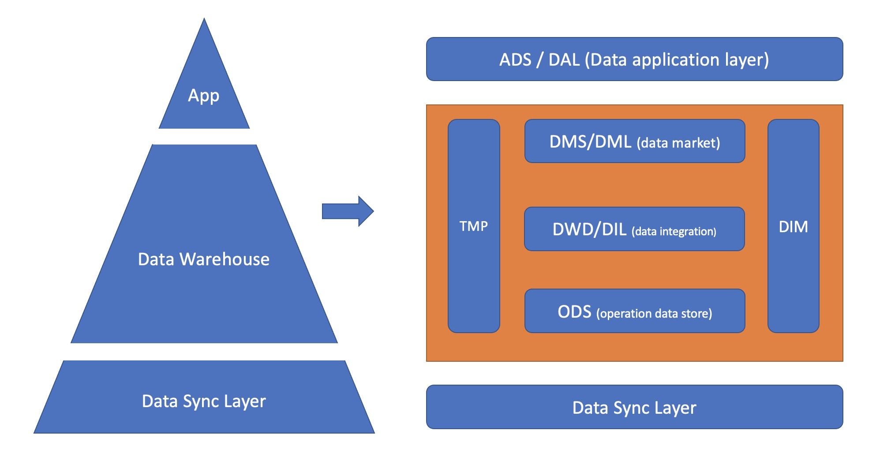

> 🛡️ **Disclaimer:**  
> The following content represents generalized industry knowledge and anonymized case practices.  
> It does **not contain any confidential, proprietary, or internal information** from any specific company.  
> The described models are **common industry practices** widely adopted by major cross-border payment providers (e.g., Ant/WorldFirst, LianLian, PingPong), and do not reflect any proprietary implementation details.

## 🎯 Data Warehouse Core Purpose

The **<mark>core purpose</mark>** of a Data Warehouse (DWH) is to **<mark>integrate and store data</mark>** from multiple sources, providing **<mark>accurate, reliable, and consistent data</mark>** for analysis, reporting, and decision-making.

It addresses:

* **<mark>Fragmentation</mark>** across systems
* Difficulty in **<mark>historical data management</mark>**
* Lack of **<mark>traceability and reliability</mark>** for compliance & BI

## 1. Data Warehouse Architecture – Hourglass Model

We follow a **<mark>business-driven layered architecture</mark>**:

👉 **<mark>ODS → DIL/DIM → DWS → ADS</mark>**

  

* **ODS (Operational Data Store):** Ingest **<mark>raw data</mark>** (e.g., binlog subscription, hourly batch).
* **DIL/DIM (Integration Layer):** **<mark>Clean, deduplicate, normalize</mark>**; build **<mark>fact</mark>** and **<mark>dimension tables</mark>**.
* **DWS (Warehouse Service):** Model around **<mark>business entities & processes</mark>** (Merchant, Store, Order, Settlement), delivering **<mark>subject-oriented wide tables</mark>**.
* **ADS (Application Layer):** Serve **<mark>BI, dashboards</mark>**.

**Development Process**

1. Define **<mark>business goals & requirements</mark>**
2. Load raw data → **<mark>ODS</mark>**
3. Transform into **<mark>fact/dim</mark>** → **<mark>DIL/DIM</mark>**
4. Aggregate by **<mark>subject themes</mark>** → **<mark>DWS</mark>**
5. Serve **<mark>reporting & BI</mark>** → **<mark>ADS</mark>**

## 2. Business Case 1 – Cross-border E-commerce Collection (Amazon Standard Collection)

### 🔹 Background

* Chinese/HK cross-border sellers operate **<mark>multiple Amazon stores</mark>** across countries.
* Sellers cannot easily open overseas bank accounts → struggle with **<mark>receiving funds, withdrawing, paying suppliers</mark>**.

### 🔹 Solution (VA Model)

* Providers (Ant/WorldFirst, Tenpay, LianLian) offer an **<mark>offshore Main VA</mark>** (real bank account).
* Each **<mark>store/currency</mark>** is assigned a **<mark>Sub-VA</mark>** (virtual ledger accounts (not real bank accounts), mapped to a Main VA).
* The system automatically aggregates **<mark>Sub-VA balances</mark>** into the **<mark>Main VA</mark>**, ensuring transaction-level traceability and regulatory compliance.

### 🔹 Business Process

```mermaid
flowchart LR
    A["1️⃣ **<mark>Merchant Registration & KYC</mark>**"]:::step1
    B["2️⃣ **<mark>Store Authorization & Binding</mark>**"]:::step2
    C["3️⃣ **<mark>Sub-VA Assigned</mark>**<br>(per store / currency)"]:::step3
    D["4️⃣ **<mark>Amazon Payout</mark>**<br>Funds → Sub-VA"]:::step4
    E["5️⃣ **<mark>Main VA Settlement</mark>**<br>Funds consolidated"]:::step5
    F["6️⃣ **<mark>Withdrawal / Supplier Payment</mark>**"]:::step6

    A --> B --> C --> D --> E --> F

    classDef step1 fill:#e6f0ff,stroke:#333;
    classDef step2 fill:#d5f5e3,stroke:#333;
    classDef step3 fill:#fff2cc,stroke:#333;
    classDef step4 fill:#ffd580,stroke:#333;
    classDef step5 fill:#f9c0c0,stroke:#333;
    classDef step6 fill:#d5b3ff,stroke:#333;
```

👉 **Amazon pays → <mark>Sub-VA</mark> (store-level) → <mark>Main VA</mark> (aggregation & settlement) → <mark>Bank/Supplier payout</mark>**

## 3. Data Warehouse How to Built

## 4. Other Info

**Shopee Official Wallet**

> In Shopee’s official wallet model, Shopee itself acts as the settlement entity. After sellers onboard and bind stores, Shopee credits their **official wallet account** (white-label offshore account powered by Tenpay).  
There is **no sub-VA per store** — store-level differentiation comes from Shopee’s internal transaction system. Funds can be disbursed (fees, supplier payments, subscription plans) or withdrawn to bank accounts.  

| No. | Amazon Standard Collection                           | Shopee Official Wallet                                      |
|-----|------------------------------------------------------|-------------------------------------------------------------|
| 1   | **Merchant Onboarding** – Merchant registers and KYC | **Merchant Onboarding** – Merchant registers and KYC        |
| 2   | **VA Assignment** – Main VA created, sub-VA per shop | **Shop Binding** – Merchant links their shops               |
| 3   | **Shop Authorization & Binding** – Sub-VA assigned   | **Funds Inflow (Top-up)** – Shopee credits merchant wallet  |
| 4   | **Amazon Pays Store VA** – Funds flow into sub-VA    | **Funds Flow & Deduction** – Payouts/deductions processed   |
| 5   | **Transaction Details via API** – Collect order data | **Merchant Card Binding** – Bank card linked for withdrawal |
| 6   | **Merchant Card Binding** – Settlement card binding  | **Payout - Withdrawal/Payment** – Merchant withdraws/pays   |
| 7   | **Withdrawal & Payout** – From Main VA to bank/supplier | **Payout - Merchant Ops** – e.g., annual subscription plan   |

### Subject-Specifc Table

**Subject-Specifc Analysis model**, covering `Merchant`, `Shop`, and `Orders`.

> Shopee's official wallet business leverages multi-dimensional data analysis to support merchant lifecycle management, transaction insights, and revenue optimization. From churn monitoring to cross-site transaction trend analysis, comprehensive dashboards and thematic tables provide strong data support for business growth, product experience enhancement, and precision operations.

<strong style="color:#1E90FF;">Merchant Subject Sample - Data Metric</strong>

| --Category-- | Field Name | Data_Type | Description |
|-----------------------------------------|--------------------------------------|-----------|-----------------------------------------------------------------------------|
| **Partition Field**   | fdate                       | BIGINT  | Partition date                                                              |
| **Primary Key**       | fgid                        | STRING  | Merchant GID (Global ID)                                                   |
| **Primary Key**       | fspid                       | STRING  | Merchant SPID (Sub-platform ID)                                            |
| **Merchant_Basic_Info** | fcompany_name       | STRING  | Company name                                                                |
| **Horizontal_Time** | fkyc_first_submit_time          | STRING  | First KYC submission time                                                   |
| **Horizontal Time** | fkyc_first_approved_time        | STRING  | First KYC approval time                                                     |
| **Horizontal Time** | fshop_apply_time                   | STRING  | Store application time                                                      |
| **Horizontal Time** | fshop_first_bind_time              | STRING  | First store binding time                                                    |
| **Horizontal Time** | fcard_first_bind_time              | STRING  | First card binding time                                                     |
| **Horizontal Time** | ffirst_disbursement_time           | STRING  | First disbursement time (funds distributed on behalf of merchant)          |
| **Horizontal Time** | ffirst_withdraw_time               | STRING  | First withdrawal to merchant bank account                                  |
| **Horizontal Time** | ffirst_payment_time                | STRING  | First payment to external supplier                                         |
| **Horizontal Time** | fsubs_plan_first_buy_time          | STRING  | First annual plan purchase time                                             |
| **Horizontal Time** | fsubs_plan_first_use_time          | STRING  | First annual plan usage time                                                |
| **Vertical - Tag** | fsite_count                    | BIGINT  | Number of sites (e.g., Shopee-TW, Shopee-SG)                               |
| **Vertical - Tag** | fshop_count                    | BIGINT  | Number of stores bound to merchant                                         |
| **Vertical - Tag** | faccount_count                 | BIGINT  | Number of accounts under this merchant                                     |
| **Vertical - Tag** | fpayee_count                   | BIGINT  | Unique payee count (withdrawal or supplier payments)                       |
| **Vertical - Tag** | fpayee_count_30d               | BIGINT  | Payee count in the last 30 days                                            |
| **Vertical - Calc** | ftrd_cnt_month                 | BIGINT  | Total transaction count this month                                         |
| **Vertical - Calc** | ftrd_cnt_year                  | BIGINT  | Total transaction count this year                                          |
| **Vertical - Calc** | flast_disbursement_amount_cny_1d    | DOUBLE    | Disbursement amount in CNY (today)                                         |
| **Vertical - Calc** | flast_disbursement_amount_usd_1d    | DOUBLE    | Disbursement amount in USD (today)                                         |
| **Vertical - Calc** | flast_disbursement_amount_cny_28d   | DOUBLE    | Disbursement amount in CNY (last 28 days)                                  |
| **Vertical - Calc** | flast_disbursement_amount_usd_28d   | DOUBLE    | Disbursement amount in USD (last 28 days)                                  |
| **Vertical - Calc** | ftrd_amt_month                      | DOUBLE    | Total transaction amount this month                                        |
| **Vertical - Calc** | ftrd_amt_year                       | DOUBLE    | Total transaction amount this year                                         |
| **Vertical - Calc** | fmax_trd_amt_month                  | DOUBLE    | Max single transaction amount this month                                   |
| **Vertical - Calc** | fmax_trd_amt_year                   | DOUBLE    | Max single transaction amount this year                                    |
| **Lifecycle Tag** | fmerchant_lifecycle_tag   | BIGINT | Merchant lifecycle status tag: 1. Not disbursed 2. New 3. Retained 4. Lost 5. Recovered 0. Default |

<strong style="color:#1E90FF;">Order Subject Sample - Data Metric</strong>

| Description | Field Name | Type | Remarks |
|-------------|------------|------|---------|
| **Partition** | fdate | BIGINT | Date partition field |
| **Primary Key** | Ftransaction_scene | BIGINT | 1: Collection Transaction Scene (Top-up to Ten-HK ) 2: Disbursement Scene – Disbursement   3: Payout Scene (Withdrawal / Pay Supplier / Subs Plan) |
| **Primary Key** | Flistid | STRING | Order ID |
| transaction_scene | Ftransaction_scene_type | trans_type | 1: Collection  2: Disbursement  3: Withholding 4: Withdrawal 5: Payment 6: Subs Plan |
| Merchant SPID | fspid | STRING | Used to join with merchant dimension table |
| - | fsite_id | STRING | One seller may have multiple sites |
| - | fshop_id | STRING | Present only in Disbursement Scene; ignored in Payout Scene |
| **Payout**   (Withdrawal/Pay/Subs) | fpayee_id | STRING | Applicable in payout scenarios |
| **Payout** | fpayee_type | BIGINT | Domestic: 1 - Personal Bank Account, 2 - Corporate Account Overseas: 1 - Same-name Account, 2 - Supplier Account |
| **Payout** | fbiz_type | BIGINT | 1: FX purchase inbound (domestic) 2: FX purchase payment (overseas) 3: FX payment (overseas) 4: Annual Subs |
| **Payout** | Fsell_cur_type | STRING | Outgoing currency, ISO 4217 format |
| **Payout** | Fbuy_cur_type | STRING | Incoming currency, ISO 4217 format |
| **Payout**  | Fbank_country | STRING | Destination country of funds |
| **Payout**  | Fproduct_code | STRING | Product code, used in annual card purchase |
| **Payout**  | Fbiz_fee_cur_type | STRING | Currency of transaction fee |
| **Payout**  | Fbiz_fee_amount | BIGINT | Transaction fee in original currency (unit: yuan) |
| **Payout**  | Fbiz_fee_amount_usd | BIGINT | Fee amount (USD) |
| **Payout**   (Withdrawal/Pay/Subs) | Fbiz_fee_amount_cny | BIGINT | Transaction fee converted to CNY |
| - | - | - |
| **General Transaction** | Fcur_type | STRING | Transaction currency |
| **General Transaction** | Famount | BIGINT | Transaction amount in original currency (unit: yuan) |
| **General Transaction** | Famount_usd | BIGINT | Converted amount in USD |
| **General Transaction** | Famount_cny | BIGINT | Converted amount in CNY |
| **General Transaction** | Ftransaction_initiation_time | STRING | Time when the transaction was initiated |

## 4. ToC Business - Global Remittances to China

Partner with overseas remittance providers (e.g. Panda Remit, Wise) to bring foreign currency into China  

> This diagram provides a basic outline, — the actual **information flow** and **funds flow** is much more complex.

| No. | Business Processes  | Description |
|:---:|---------------------|-------------|
| pre 1   | Partner Onboarding  | Partners complete a onboarding process. Risk & compliance teams perform due diligence. |
| pre 2   | Institution Funding | Partners pre-fund a designated account to ensure sufficient liquidity for remittance. |
| pre 3   | Currency Exchange   | Based on settlement needs, foreign currency is converted into RMB. |
| 4   | Remittance Service | End-users initiate remittance via the provider's app by submitting sender and recipient info. 1. If the recipient is new, an SMS prompts setup of a receiving card. 2. The provider calls the remittance API to submit the order. 3. Funds are routed into local settlement accounts. |
| 5   | Payment Collection  | Recipients collect RMB via digital wallets or linked bank-cards. |

---

**Subject-Specifc Analysis model**

> covering `Sending Institution (Remittance Providers)`, `Orders`, and `Users`.

1. **Sending Institution (SI)** : Analysed key metrics (countries, currencies and transaction, user volumes, fees, FX income ...), produced reports of transaction & profits to guide improvements.
2. **Orders** : 3 stage life-cycle funnel to measure conversion rates and bottleneck. - Order status: A: Provider order | B: Account opening process | C:  Complete fund receipt.
3. **Users** : basic info, behaviour, life-cycle, preferences for targeted campaigns.

**Regulatory Reporting** 

In cross-border inbound remittance to China, user orders are recorded individually (1-to-1), while actual fund settlements arrive in batches. For regulatory reconciliation—especially under HK MSO, MAS MPI, or SAFE/PBoC oversight—we ensure each fund batch (gather_result_list) is accurately matched to valid user orders (remit_list). This ensures auditability, mitigates AML risks, and enables accurate compliance reporting.

DML：fundin_order_regulation

| Field                  | Source | Description                                                                 |
|-----------------------|--------|-----------------------------------------------------------------------------|
| `Flistid`              | T1     | Remittance order ID (primary key)                                           |
| `Forg_id` / `Forg_name` | T1     | Sending institution ID / name                                              |
| `Ftran_amt`            | T1     | Remitted amount in CNY                                                      |
| `Ftran_ccy`            | T1     | Currency type (fixed as CNY)                                                |
| `Ffund_inflow_time`    | T5     | Fund arrival time in China (core time field)                                |
| `Fname_cn_fid`         | T1     | Encrypted recipient name                                                    |
| `Fcre_type` / `Fcre_id_fid` | T1     | Recipient ID type / encrypted ID (used to identify domestic residency and deduplicate recipients) |
| `Fpurpose_code`        | T1     | Purpose of remittance (e.g., education, salary, family support)            |
| `Fpay_final_time`      | T1     | Final timestamp of remittance success or failure                            |

