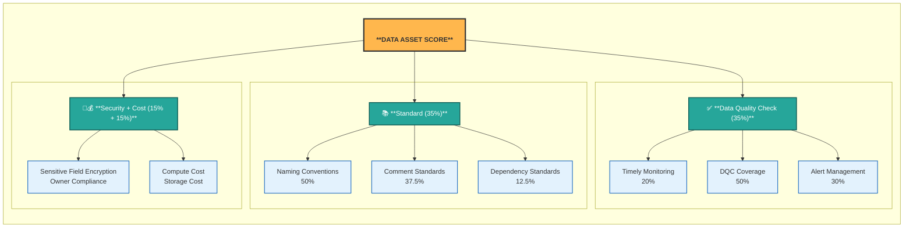
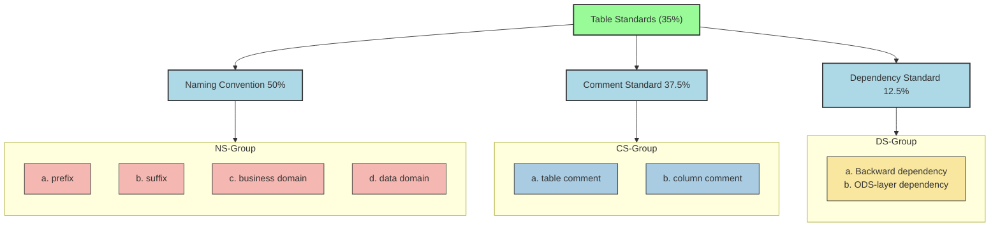
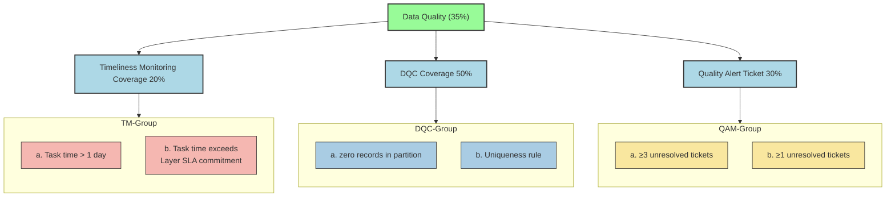

## Data Governance - Data Asset Score

**🔹 Background & Motivation**

> Rapid growth of payments business exposed chaos in our Hive/Spark data layer: inconsistent table names, missing comments, unmanaged dependencies, quality checks, security compliance, or cost inefficiencies.

1. Table Standards (35%): naming, comments, dependency hygiene
2. Data Quality Checks (35%): SLA‑driven timeliness, DQC rule coverage, alert management
3. Security (15%): sensitive‑field encryption & owner compliance
4. Cost (15%): compute and storage cost

Data Governance for 🚀 SLA Optimisation

| No. | ✨ Optimisation Area                 | 📌 Description                                                                                                          |
|-----|--------------------------------------------------------------------------|-----------------------------------------------------------------------------------|
| 1️⃣ | 🔗 **Workflow Dependency**           | Removed non-critical and redundant dependencies to streamline DAG execution.                                           |
| 2️⃣ | ⏱️ **Trigger-Based Scheduling**      | Replaced fixed-time triggers with dependency-based scheduling. Tasks now auto-execute upon upstream success.        |
| 3️⃣ | 🚨 **Monitoring & Alerting**         | Added alerting for job failures and delays, enabling early detection and faster troubleshooting.                       |
| 4️⃣ | 🧩 **Spark Job Optimization**        | Prioritized optimization of long-running (1h+) critical path jobs and de-emphasized low-impact ones.                   |

**Table Standards**

**Data Quality Check**

**SECURITY Standards**

**COST Standards**
