# data-warehouse-solutions

## 1. Data Warehouse Architecture 

  

Built data warehouse (ODS > DIL > DML > DAL) to ingest, clean, transform, data
into fact and dimension tables. Defined data domains, granularity, metrics, and
encoded business rules in DML for subject-oriented, multi-dimensional analysis.

**data domain**

| No. | Domain Name | Description |
|-----|-------------|-------------|
| 1   | Customer (USR) | Includes individuals, merchants, and users. Covers user information, credit bureau data, and personal details such as education, occupation, etc. |
| 2   | Product (PRD) | Information related to services and products, such as credit card repayment, red packets, etc. |
| 3   | Transaction (TRD) | Order lifecycle management, including order creation, payment, success, and closure. |
| 4   | Event (EVT) | Includes risk events, marketing activities, click logs, etc. |
| 5   | Agreement (AGT) | Contract-related information. |
| 6   | Finance (FIN) | Financial analytics, e.g., reserve balances at banks, overdraft limits for personal accounts. |
| ... | ... | ... |

## 2. ToC Business Introduce

Cross-border remittances to China

```mermaid
flowchart LR
    %% Style definitions
    classDef user      fill:#E8F5E9,stroke:#388E3C,stroke-width:1px
    classDef product   fill:#FFEBEE,stroke:#C62828,stroke-width:1px
    classDef infra     fill:#E3F2FD,stroke:#1976D2,stroke-width:1px
    classDef overseas  stroke:#388E3C,stroke-dasharray:5 5,stroke-width:2px
    classDef domestic  stroke:#C62828,stroke-dasharray:5 5,stroke-width:2px

    %% Overseas section
    subgraph Overseas
        direction TB
        Sender["Sender"]:::user
        SI["Sending Institution - SI"]:::product
        TRS["Remittance Services - TRS"]:::infra
    end

    %% Onshore China section
    subgraph "Onshore China"
        direction TB
        RI["Receiving Institution - RI"]:::product
        Recipient["Recipient"]:::user
    end

    %% Transaction flows
    Sender -->|initiate transfer <br> make payment| SI
    SI     -->|Forward Transfer <br> Prefund | TRS
    TRS    -->|Forward Transfer <br> Settlement| RI
    RI -.->| Notify| Recipient

    %% Apply region-specific outline styles
    class Sender,SI,TRS overseas
    class RI,Recipient domestic

```

- Partner with overseas remittance providers (e.g. Panda Remit, Wise) to bring foreign currency into China  
- Recipients collect funds via WeChat Wallet or their linked bank account  

**Key Business Processes**

| No. | Step                          | Description |
|:-----:|-------------------------------|-------------|
| **1**                         | Remittance Institutions Onboarding      | cooperate Institutions (e.g. Panda Remit, Wise) completes our standard onboarding and submits required documents. risk & compliance team then reviews.                                                                                                                                                                                                                                       |
| **2**                         | Institution Funding                     | Providers transfer funds (usually USD or EUR, sometimes CNH) via bank wire into their ZX account to ensure sufficient balance for customer remittances.                                                                                                                                                                                                                                                                           |
| **3**                         | Institution Currency Exchange           | Based on partner needs, convert foreign‑currency balances in their ZX account into RMB:                                                                                                                                                                                                                                               |
| **4**                             | Remittance                              | Customers initiate a remittance via app by entering sender and recipient details.   1. If the recipient is new, TRS sends an SMS with a link to set up a receiving card.   2. The provider calls the ZX API to submit the order.   3. Funds are settled into TRS accounts in China.                                                                                                                                                                   |
| **5**                   | Receiving Funds                         | Recipients collect the remitted CNY via Wallet or their linked bank card.                                                                                                                                                                                                                                                                                           |

