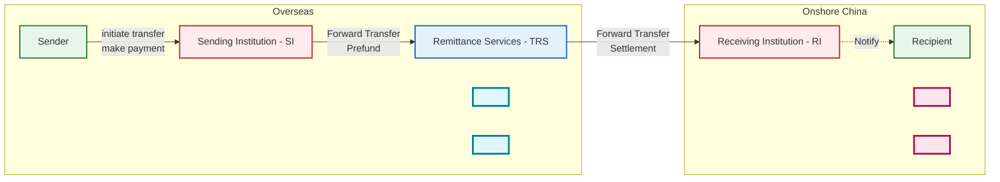

# Data Warehouse Solutions

> 🛡️ **Disclaimer:**  
> The following content represents generalized industry knowledge and anonymized case practices.  
> It does **not contain any confidential, proprietary, or internal information** from any specific company.

---

## 1. Data Warehouse Architecture 

Built a layered data warehouse (ODS > DIL > DML > DAL) to ingest, clean, and transform data into fact and dimension tables. Defined data domains, granularity, metrics, and embedded business logic for subject-oriented, multi-dimensional analysis.

  

**Data Domains**

| No. | Domain Name    | Description |
|-----|----------------|-------------|
| 1   | Customer (USR) | Covers individuals and merchants, including user info, identity data, and credit profiles. |
| 2   | Transaction (TRD) | Order lifecycle, including creation, payment, completion, and closure. |
| 3   | Event (EVT)    | Risk signals, marketing campaigns, click logs, etc. |
| …   | …              | … |

---

## 2. ToC Business - Global Remittances to China

Partner with overseas remittance providers (e.g. Panda Remit, Wise) to bring foreign currency into China  

| No. | Business Processes  | Description |
|:---:|---------------------|-------------|
| pre 1   | Partner Onboarding  | Partners complete a onboarding process. Risk & compliance teams perform due diligence. |
| pre 2   | Institution Funding | Partners pre-fund a designated account to ensure sufficient liquidity for remittance. |
| 3   | Currency Exchange   | Based on settlement needs, foreign currency is converted into RMB. |
| 4   | Remittance Service | End-users initiate remittance via the provider's app by submitting sender and recipient info. 1. If the recipient is new, an SMS prompts setup of a receiving card. 2. The provider calls the remittance API to submit the order. 3. Funds are routed into local settlement accounts. |
| 5   | Payment Collection  | Recipients collect RMB via digital wallets or linked bank-cards. |

**Subject-Specifc Analysis model**, covering `Remittance Providers (Institution)`, `Orders`, and `Users`.

## 3. ToB Business - Cross-border E-commerce Collection and Payment

