# Data Warehouse Solutions

> 🛡️ **Disclaimer:**  
> The following content represents generalized industry knowledge and anonymized case practices.  
> It does **not contain any confidential, proprietary, or internal information** from any specific company.

---

## 1. Data Warehouse Architecture 

  

Built a layered data warehouse (ODS > DIL > DML > DAL) to ingest, clean, and transform data into fact and dimension tables. Defined data domains, granularity, metrics, and embedded business logic for subject-oriented, multi-dimensional analysis.

**Data Domains**

| No. | Domain Name    | Description |
|-----|----------------|-------------|
| 1   | Customer (USR) | Covers individuals and merchants, including user info, identity data, and credit profiles. |
| 2   | Product (PRD)  | Service or product metadata such as repayment tools, vouchers, etc. |
| 3   | Transaction (TRD) | Order lifecycle, including creation, payment, completion, and closure. |
| 4   | Event (EVT)    | Risk signals, marketing campaigns, click logs, etc. |
| 5   | Agreement (AGT)| Contract-level information and binding terms. |
| …   | …              | … |

---

## 2. Inbound Remittance to China (ToC Flow – Generalized)

```mermaid
flowchart LR
    %% Style definitions
    classDef user      fill:#E8F5E9,stroke:#388E3C,stroke-width:1px
    classDef product   fill:#FFEBEE,stroke:#C62828,stroke-width:1px
    classDef infra     fill:#E3F2FD,stroke:#1976D2,stroke-width:1px
    classDef overseas  stroke:#388E3C,stroke-dasharray:5 5,stroke-width:2px
    classDef domestic  stroke:#C62828,stroke-dasharray:5 5,stroke-width:2px

    %% Overseas section
    subgraph Overseas
        direction TB
        Sender["Sender"]:::user
        SI["Sending Institution - SI"]:::product
        TRS["Remittance Services - TRS"]:::infra
    end

    %% Onshore China section
    subgraph "Onshore China"
        direction TB
        RI["Receiving Institution - RI"]:::product
        Recipient["Recipient"]:::user
    end

    %% Transaction flows
    Sender -->|initiate transfer <br> make payment| SI
    SI     -->|Forward Transfer <br> Prefund | TRS
    TRS    -->|Forward Transfer <br> Settlement| RI
    RI -.->| Notify| Recipient

    %% Apply region-specific outline styles
    class Sender,SI,TRS overseas
    class RI,Recipient domestic

```

- Partner with overseas remittance providers (e.g. Panda Remit, Wise) to bring foreign currency into China  
- Recipients collect funds via WeChat Wallet or their linked bank account  

**Key Business Processes**

| No. | Step                | Description |
|:---:|---------------------|-------------|
| 1   | Partner Onboarding  | Partners complete a standard onboarding process and submit required documents. Risk & compliance teams perform due diligence. |
| 2   | Institution Funding | Partners pre-fund a designated account (typically in USD, EUR, or CNH) to ensure sufficient liquidity for remittance. |
| 3   | Currency Exchange   | Based on settlement needs, foreign currency is converted into RMB either in bulk or per transaction. |
| 4   | Remittance          | End-users initiate remittance via the provider's app by submitting sender and recipient info. 1. If the recipient is new, an SMS prompts setup of a receiving card. 2. The provider calls the remittance API to submit the order. 3. Funds are routed into local settlement accounts. |
| 5   | Funds Disbursement  | Recipients collect RMB via digital wallets or linked local bank cards. |

