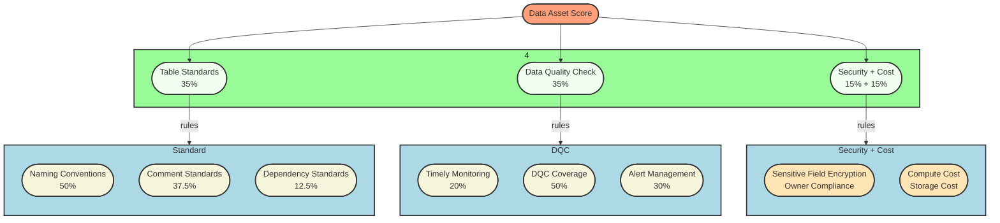
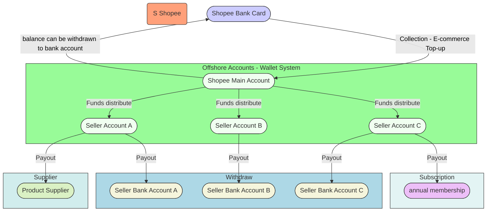
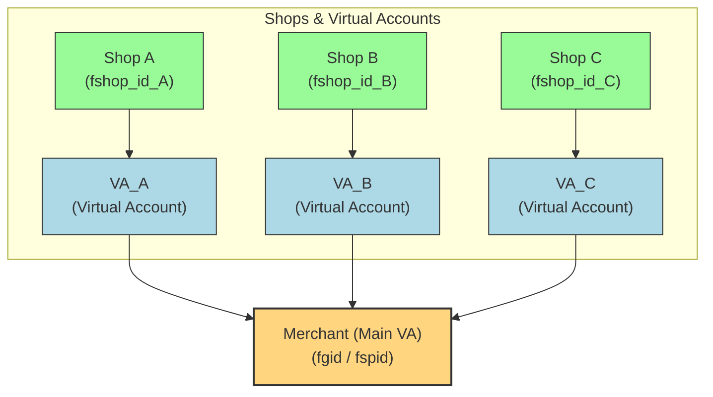

> 🛡️ **Disclaimer:**  
> The following content represents generalized industry knowledge and anonymized case practices.  
> It does **not contain any confidential, proprietary, or internal information** from any specific company.

---

# Data Warehouse Solutions

The core purpose of a data warehouse is to integrate and store large amounts of internal and external data, providing accurate, reliable data for analysis, reporting, and decision-making, while addressing issues like **fragmentation**, and difficult historical data management.

## 1. Data Warehouse Architecture - Hourglass

Built a layered data warehouse (ODS > DIL > DML > DAL) to ingest, clean, and transform data into fact and dimension tables. Defined data domains, granularity, metrics, and embedded business logic for subject-oriented, multi-dimensional analysis

💡Why Layered Design?

Dimensional Modeling
  It follows the principle of data layering (e.g., DIL, DML), which enables clear separation of concerns between raw data integration and subject-oriented analysis.

> - Clarifies responsibilities across layers (e.g., raw events vs. analysis-ready data)  
> - Supports atomic and aggregated metrics  
> - Improves reusability and maintainability  
> - Aligns with modern data warehouse best practices (e.g., Kimball methodology)
> - 🧭 Industry Terminology — DIL and DML follow the same layered logic as DWD/DWS in other companies. Naming may different, but all follow Kimball-style dimensional modeling.

  

---

**Data Warehouse Planning :**  

> **End‑to‑end-from Planning → Dimension Management → Metric Definition → Physical Schema Modeling → Subject‑Area Delivery—featuring clear separation of layers and single‑responsibility.**

Professional Term Explanation

| No. | Term                            | Description                                                                 |
|-----|---------------------------------|-----------------------------------------------------------------------------|
| 1   | Data Warehouse Planning         | High-level planning of the warehouse, including domains, granularity, and load strategies. |
| 2   | Business Domain                 | High-level business categories such as `Cross-border Payment` and `Credit Card`. |
| 3   | Business Process                | Specific workflows describing how data flows through business operations.   |
| 4   | Data Domain                     | Logical grouping of data, e.g., user, product, funds, contract.             |
| 5   | Granularity                     | Level of detail in data (e.g., per transaction, per day, per user).         |
| 6   | Constraints                     | External requirements such as SLA, compliance, or system limitations.       |
| 7   | Load Strategy                   | Full or incremental data ingestion approach.                                |
| 8   | Dimension Management            | Design and governance of dimensions and their hierarchies.                  |
| 9   | Dimension Tables                | Tables that describe entities used for slicing facts, such as user. |
| 10  | Metric Definition               | Systematic definition and classification of metrics.                        |
| 11  | Atomic Metrics                  | Direct metrics from raw events with no transformation (stored in DIL).      |
| 12  | Simple Derived Metrics          | Lightly transformed fields like `age_group`, can exist in DIL or DML.       |
| 13  | Complex Derived Metrics         | Aggregated metrics involving logic or multiple tables (mainly in DML).      |
| 14  | Horizontal Metrics              | Timepoint or milestone fields (e.g., first_payment_time), stored horizontally, one row per entity. |
| 15  | Vertical Metrics                | Aggregated tags or metrics stacked by type (e.g., trd_cnt_30d, trd_amt_month). |
| 16  | Physical Schema Modeling        | The process of creating actual dimension and fact tables in the warehouse.  |
| 17  | Fact Tables                     | Tables that store measurable events, often with foreign keys to dimensions. |
| 18  | Data-Mart / Subject Modeling    | Design of wide analytical tables for multi-metric, multi-perspective analysis, focused on a specific entity such as user, merchant, or order. |

data development process：
1. Defined business goals and requirements.
2. Collected data into ODS and integrated into fact and dimension tables (DIL/DIM).
3. Organised data domains, determined data granularity, and designed key metrics.
4. Abstracted business and data subject analyses into DML tables.
5. Delivered reporting, supporting subject-specific and multi-dimensional analysis

```mermaid
flowchart TB

%% Planning
subgraph PL["PL"]
  direction TB
  Data_Warehouse_Planning["📦 Data Warehouse Planning"]:::topNode
  PL1["Business Domain"]:::subgroupNode
  PL2["Business Processe"]:::subgroupNode
  PL3["Data Domain"]:::subgroupNode
  PL5["Granularity"]:::subgroupNode
  PL6["Constraints"]:::subgroupNode
  PL7["Load Strategy"]:::subgroupNode
end

%% Dimension Management
subgraph DM["DM"]
  direction TB
  Dimension_Management["📘 Dimension Management"]:::secondNode
  DM1["Dimension Classification"]:::yellowNode
  DM2["Dimension Tables"]:::yellowNode
  DM3["Dimension Attributes"]:::yellowNode
end

%% Metric Definition
subgraph MD["MD: Metric Definition"]
  direction TB
  Metric_Definition["📊 Metric Definition"]:::secondNode
  AM["Atomic Metrics<br>(DIL / Fact Tables)"]:::purpleNode
  SM["Simple Derived Metrics<br>(DIL or DML)"]:::purpleNode
  CM["Complex Derived Metrics<br>(Mainly in DML)"]:::purpleNode
end

%% Physical Schema Modeling
subgraph PH["PH"]
  direction TB
  Schema_Physical["📐 Physical Schema Modeling"]:::secondNode
  SM1["Dimension Tables"]:::blueNode
  SM2["Fact Tables"]:::blueNode
end

%% Data‑Mart / Subject Modeling
subgraph DMART["D-MART"]
  direction TB
  Data_Mart["🎯 Data‑Mart Modeling"]:::secondNode
  SM3["Subject Tables"]:::blueNode
  WAT3["Wide / Aggregated Tables"]:::blueNode
end

%% End‑to‑end Flow
Data_Warehouse_Planning --> Dimension_Management
Dimension_Management   --> Metric_Definition
Metric_Definition      --> Schema_Physical
Schema_Physical        --> Data_Mart

%% Styling
classDef topNode      fill:#D1F2EB,stroke:#117A65,stroke-width:2px;
classDef secondNode   fill:#EAF2F8,stroke:#2874A6,stroke-width:2px;
classDef subgroupNode fill:#FCF3CF,stroke:#B7950B,stroke-width:1px;
classDef yellowNode   fill:#FDEBD0,stroke:#CA6F1E,stroke-width:1px;
classDef purpleNode   fill:#EBDEF0,stroke:#884EA0,stroke-width:1px;
classDef blueNode     fill:#D6EAF8,stroke:#2E86C1,stroke-width:1px;
```

## 2. Data Governance - Data Asset Score

**🔹 Background & Motivation**

> Rapid growth of payments business exposed chaos in our Hive/Spark data layer: inconsistent table names, missing comments, unmanaged dependencies, quality checks, security compliance, or cost inefficiencies.

> Previously, only Data Quality Checks (DQC) were used to evaluate data assets. In this project, expansion of the Data Asset Scoring mechanism by introducing 3 new dimensions:
> Table Standards (35%) & Security (15%) & Cost (15%)  **Combined with DQC (35%)**, we built a comprehensive 100-point scoring system that evaluates the usability, reliability, compliance, and cost-efficiency of data assets.

<strong>🎯 Goals & Expected Benefits</strong>
  
Updating the Data Asset Scoring framework (0–100 points) to quantify each table’s:

1. Table Standards (35%): naming, comments, dependency hygiene
2. Data Quality Checks (35%): SLA‑driven timeliness, DQC rule coverage, alert management
3. Security (15%): sensitive‑field encryption & owner compliance
4. Cost (15%): compute and storage cost

  

<strong>⚙️ Design & Implementation</strong>

1. Scoring Rules automated via SparkSQL jobs running daily;
2. Table (names, comments, dependencies) extracted from Hive Meta Table & Lineage Relationship Table.
3. DQC rules stored and versioned in a rule table, evaluation output is written into a DQC_Score table.
4. Security – Perform sensitive‑field encryption checks using the scan results supplied by the data-security‑platform team
5. Cost – Implemented by our Data Platform team via daily scans for stale/“garbage” tables and by defining table lifecycle stages. Each day’s cost evaluation output is written into a Cost_Score table.
6. Whitelist Mechanism allows table owners to apply for temporary exemptions.
7. Finally, together the scores from all four dimensions, applied our weighted formula, and loaded the consolidated score into the central Data Asset Score table.

| Field Name    | Description          |
| ------------- | -------------------- |
| fdate  | Date           |
| fetl_time  | ETL time           |
| ftable\_name  | Table name           |
| fowner        | Table owner          |
| fbusiness     | Business Domain   |
| fstd\_score   | Standards score      |
| fdqc\_score   | Data quality score   |
| fsecu\_score  | Security score       |
| fcost\_score  | Cost score           |
| ftotal\_score | Total score          |
| fscore\_time  | Scoring timestamp    |
| fexempt\_flag | Exemption flag (Y/N) |

<strong>🚀 Push via Platform & Automation & Manual configuration</strong>

- ✅ Enforced **naming conventions** for all new tables through platform-level **constraints** in the visual table-creation process
- ✅ **Auto-configured** zero-record checks and primary key uniqueness constraints  
- ✅ Enhanced **whitelist governance**, preventing exempt tables from impacting scoring  
- ✅ **Excluded** temporary tables prefixed with `temp_`, `tmp_`, or `check_` from evaluation scope

<strong>📈 Results : Average asset score improved from 77+ → 86+</strong>

> Overall Health Improvement
> On a 100‑point scale, portfolio of tables has moved from the “C+” range up into the “B+” range—meaning that, on average, assets now meet governance criteria (naming standards, DQC coverage, security and cost controls).

> 🌱 Future Extensions: Incorporate data‑usage heatmaps & Add partition‑level DQC quality checks.

Data Governance for 🚀 SLA Optimisation

| No. | ✨ Optimisation Area                 | 📌 Description                                                                                                          |
|-----|--------------------------------------------------------------------------|-----------------------------------------------------------------------------------|
| 1️⃣ | 🔗 **Workflow Dependency**           | Removed non-critical and redundant dependencies to streamline DAG execution.                                           |
| 2️⃣ | ⏱️ **Trigger-Based Scheduling**      | Replaced fixed-time triggers with dependency-based scheduling. Tasks now auto-execute upon upstream success.        |
| 3️⃣ | 🚨 **Monitoring & Alerting**         | Added alerting for job failures and delays, enabling early detection and faster troubleshooting.                       |
| 4️⃣ | 🧩 **Spark Job Optimization**        | Prioritized optimization of long-running (1h+) critical path jobs and de-emphasized low-impact ones.                   |

**Table Standards**

**Data Quality Check**

```mermaid
flowchart TB
  %% Top-level: Data Quality
  DQ["Data Quality (35%)"]
  DQ --> TM["Timeliness Monitoring Coverage 20%"]
  DQ --> DQC["DQC Coverage 50%"]
  DQ --> QAM["Quality Alert Ticket 30%"]

  %% Timeliness Monitoring Subgroup
  subgraph TM-Group
    direction TB
    TM1["a. Task time > 1 day"]
    TM2["b. Task time exceeds <br> Layer SLA commitment"]
  end
  TM --> TM-Group

  %% DQC Assurance Subgroup
  subgraph DQC-Group
    direction TB
    DQC1["a. zero records in partition"]
    DQC2["b. Uniqueness rule"]
  end
  DQC --> DQC-Group

  %% Quality Alert Subgroup
  subgraph QAM-Group
    direction TB
    QAM1["a. ≥3 unresolved tickets"]
    QAM2["b. ≥1 unresolved tickets"]
  end
  QAM --> QAM-Group

  %% Styling
  classDef topNode fill:#98FB98,stroke:#333,stroke-width:2px
  classDef secondNode fill:#ADD8E6,stroke:#333,stroke-width:2px
  classDef pinkNode fill:#F5B7B1,stroke:#333,stroke-width:1px
  classDef purpleNode fill:#A9CCE3,stroke:#333,stroke-width:1px
  classDef yellowNode fill:#F9E79F,stroke:#333,stroke-width:1px

  class DQ topNode
  class TM,DQC,QAM secondNode
  class TM1,TM2 pinkNode
  class DQC1,DQC2,DQC3,DQC4 purpleNode
  class QAM1,QAM2,QAM3,QAM4 yellowNode
```

  
## 3. ToB Business - Cross-border E-commerce Collection and Payout

> Background:
>
> - Under the standard collection model, Shopee currently only supports local settlement of sales proceeds—meaning funds from sold goods can only be settled into local overseas bank accounts.
> - However, for **cross-border sellers, it is not feasible to open overseas bank accounts**. As a result, sellers face challenges in **receiving payments and accessing their earnings freely**.
> - Ten-Pay is great at getting money back to China and distributing it efficiently.

So, Provide offshore accounts (AS Shopee official wallet) and **fund repatriation** services `[riːˌpætriˈeɪʃən]` for Shopee cross-border sellers based in Mainland China, Hong Kong, and South Korea.

### Business Process 

| No. | Business Process                    | Description                                                                                  |
|-----|-------------------------------------|----------------------------------------------------------------------------------------------|
| 1   | **Merchant Onboarding**            | Merchant registers on the platform and completes kyc.   |
| 2   | **Merchant Shop Binding**         | Merchant links their shops. |
| 3   | **Funds Inflow (E-commerce Top-up)** | E-commerce Top-up |
| 4   | **Funds Flow to Seller Account (Disbursement & Deduction)** | The platform processes payouts or automatic deductions on behalf of the merchant (e.g. platform fees, commission). |
| 5   | **Merchant bank Card Binding**          | Merchant binds a settlement bank card for receiving withdrawals.     |
| 6   | **Payout - Withdrawal and Payment**         | Merchant initiates fund withdrawal to their own bank account or makes payments to external suppliers. |
| 7   | **Payout - Merchant Operations (e.g., Annual Subscription Plan)** | Merchant performs business-related actions such as purchasing subscription plans or value-added services. |

### Subject-Specifc Table

**Subject-Specifc Analysis model**, covering `Merchant`, `Shop`, and `Orders`.

> Shopee's official wallet business leverages multi-dimensional data analysis to support merchant lifecycle management, transaction insights, and revenue optimization. From churn monitoring to cross-site transaction trend analysis, comprehensive dashboards and thematic tables provide strong data support for business growth, product experience enhancement, and precision operations.

**Amazon**

- Merchant-level subject table: total recharge, lifecycle tags, retention.
- Shop-level subject table: site, platform, per-shop inflow/outflow, active vs inactive shops.
- Order-level subject table: transaction-level granularity for detailed analysis.

<strong style="color:#1E90FF;">Merchant Subject Sample - Data Metric</strong>

| --Category-- | Field Name | Data_Type | Description |
|-----------------------------------------|--------------------------------------|-----------|-----------------------------------------------------------------------------|
| **Partition Field**   | fdate                       | BIGINT  | Partition date                                                              |
| **Primary Key**       | fgid                        | STRING  | Merchant GID (Global ID)                                                   |
| **Primary Key**       | fspid                       | STRING  | Merchant SPID (Sub-platform ID)                                            |
| **Merchant_Basic_Info** | fcompany_name       | STRING  | Company name                                                                |
| **Horizontal_Time** | fkyc_first_submit_time          | STRING  | First KYC submission time                                                   |
| **Horizontal Time** | fkyc_first_approved_time        | STRING  | First KYC approval time                                                     |
| **Horizontal Time** | fshop_apply_time                   | STRING  | Store application time                                                      |
| **Horizontal Time** | fshop_first_bind_time              | STRING  | First store binding time                                                    |
| **Horizontal Time** | fcard_first_bind_time              | STRING  | First card binding time                                                     |
| **Horizontal Time** | ffirst_disbursement_time           | STRING  | First disbursement time (funds distributed on behalf of merchant)          |
| **Horizontal Time** | ffirst_withdraw_time               | STRING  | First withdrawal to merchant bank account                                  |
| **Horizontal Time** | ffirst_payment_time                | STRING  | First payment to external supplier                                         |
| **Horizontal Time** | fsubs_plan_first_buy_time          | STRING  | First annual plan purchase time                                             |
| **Horizontal Time** | fsubs_plan_first_use_time          | STRING  | First annual plan usage time                                                |
| **Vertical - Tag** | fsite_count                    | BIGINT  | Number of sites (e.g., Shopee-TW, Shopee-SG)                               |
| **Vertical - Tag** | fshop_count                    | BIGINT  | Number of stores bound to merchant                                         |
| **Vertical - Tag** | faccount_count                 | BIGINT  | Number of accounts under this merchant                                     |
| **Vertical - Tag** | fpayee_count                   | BIGINT  | Unique payee count (withdrawal or supplier payments)                       |
| **Vertical - Tag** | fpayee_count_30d               | BIGINT  | Payee count in the last 30 days                                            |
| **Vertical - Calc** | ftrd_cnt_month                 | BIGINT  | Total transaction count this month                                         |
| **Vertical - Calc** | ftrd_cnt_year                  | BIGINT  | Total transaction count this year                                          |
| **Vertical - Calc** | flast_disbursement_amount_cny_1d    | DOUBLE    | Disbursement amount in CNY (today)                                         |
| **Vertical - Calc** | flast_disbursement_amount_usd_1d    | DOUBLE    | Disbursement amount in USD (today)                                         |
| **Vertical - Calc** | flast_disbursement_amount_cny_28d   | DOUBLE    | Disbursement amount in CNY (last 28 days)                                  |
| **Vertical - Calc** | flast_disbursement_amount_usd_28d   | DOUBLE    | Disbursement amount in USD (last 28 days)                                  |
| **Vertical - Calc** | ftrd_amt_month                      | DOUBLE    | Total transaction amount this month                                        |
| **Vertical - Calc** | ftrd_amt_year                       | DOUBLE    | Total transaction amount this year                                         |
| **Vertical - Calc** | fmax_trd_amt_month                  | DOUBLE    | Max single transaction amount this month                                   |
| **Vertical - Calc** | fmax_trd_amt_year                   | DOUBLE    | Max single transaction amount this year                                    |
| **Lifecycle Tag** | fmerchant_lifecycle_tag   | BIGINT | Merchant lifecycle status tag: 1. Not disbursed 2. New 3. Retained 4. Lost 5. Recovered 0. Default |

<strong style="color:#1E90FF;">Order Subject Sample - Data Metric</strong>

| Description | Field Name | Type | Remarks |
|-------------|------------|------|---------|
| **Partition** | fdate | BIGINT | Date partition field |
| **Primary Key** | Ftransaction_scene | BIGINT | 1: Collection Transaction Scene (Top-up to Ten-HK ) 2: Disbursement Scene – Disbursement   3: Payout Scene (Withdrawal / Pay Supplier / Subs Plan) |
| **Primary Key** | Flistid | STRING | Order ID |
| transaction_scene | Ftransaction_scene_type | trans_type | 1: Collection  2: Disbursement  3: Withholding 4: Withdrawal 5: Payment 6: Subs Plan |
| Merchant SPID | fspid | STRING | Used to join with merchant dimension table |
| - | fsite_id | STRING | One seller may have multiple sites |
| - | fshop_id | STRING | Present only in Disbursement Scene; ignored in Payout Scene |
| **Payout**   (Withdrawal/Pay/Subs) | fpayee_id | STRING | Applicable in payout scenarios |
| **Payout** | fpayee_type | BIGINT | Domestic: 1 - Personal Bank Account, 2 - Corporate Account Overseas: 1 - Same-name Account, 2 - Supplier Account |
| **Payout** | fbiz_type | BIGINT | 1: FX purchase inbound (domestic) 2: FX purchase payment (overseas) 3: FX payment (overseas) 4: Annual Subs |
| **Payout** | Fsell_cur_type | STRING | Outgoing currency, ISO 4217 format |
| **Payout** | Fbuy_cur_type | STRING | Incoming currency, ISO 4217 format |
| **Payout**  | Fbank_country | STRING | Destination country of funds |
| **Payout**  | Fproduct_code | STRING | Product code, used in annual card purchase |
| **Payout**  | Fbiz_fee_cur_type | STRING | Currency of transaction fee |
| **Payout**  | Fbiz_fee_amount | BIGINT | Transaction fee in original currency (unit: yuan) |
| **Payout**  | Fbiz_fee_amount_usd | BIGINT | Fee amount (USD) |
| **Payout**   (Withdrawal/Pay/Subs) | Fbiz_fee_amount_cny | BIGINT | Transaction fee converted to CNY |
| - | - | - |
| **General Transaction** | Fcur_type | STRING | Transaction currency |
| **General Transaction** | Famount | BIGINT | Transaction amount in original currency (unit: yuan) |
| **General Transaction** | Famount_usd | BIGINT | Converted amount in USD |
| **General Transaction** | Famount_cny | BIGINT | Converted amount in CNY |
| **General Transaction** | Ftransaction_initiation_time | STRING | Time when the transaction was initiated |

## 4. ToC Business - Global Remittances to China

Partner with overseas remittance providers (e.g. Panda Remit, Wise) to bring foreign currency into China  

> This diagram provides a basic outline, — the actual **information flow** and **funds flow** is much more complex.

| No. | Business Processes  | Description |
|:---:|---------------------|-------------|
| pre 1   | Partner Onboarding  | Partners complete a onboarding process. Risk & compliance teams perform due diligence. |
| pre 2   | Institution Funding | Partners pre-fund a designated account to ensure sufficient liquidity for remittance. |
| pre 3   | Currency Exchange   | Based on settlement needs, foreign currency is converted into RMB. |
| 4   | Remittance Service | End-users initiate remittance via the provider's app by submitting sender and recipient info. 1. If the recipient is new, an SMS prompts setup of a receiving card. 2. The provider calls the remittance API to submit the order. 3. Funds are routed into local settlement accounts. |
| 5   | Payment Collection  | Recipients collect RMB via digital wallets or linked bank-cards. |

---

**Subject-Specifc Analysis model**

> covering `Sending Institution (Remittance Providers)`, `Orders`, and `Users`.

1. **Sending Institution (SI)** : Analysed key metrics (countries, currencies and transaction, user volumes, fees, FX income ...), produced reports of transaction & profits to guide improvements.
2. **Orders** : 3 stage life-cycle funnel to measure conversion rates and bottleneck. - Order status: A: Provider order | B: Account opening process | C:  Complete fund receipt.
3. **Users** : basic info, behaviour, life-cycle, preferences for targeted campaigns.

**Regulatory Reporting** 

In cross-border inbound remittance to China, user orders are recorded individually (1-to-1), while actual fund settlements arrive in batches. For regulatory reconciliation—especially under HK MSO, MAS MPI, or SAFE/PBoC oversight—we ensure each fund batch (gather_result_list) is accurately matched to valid user orders (remit_list). This ensures auditability, mitigates AML risks, and enables accurate compliance reporting.

DML：fundin_order_regulation

| Field                  | Source | Description                                                                 |
|-----------------------|--------|-----------------------------------------------------------------------------|
| `Flistid`              | T1     | Remittance order ID (primary key)                                           |
| `Forg_id` / `Forg_name` | T1     | Sending institution ID / name                                              |
| `Ftran_amt`            | T1     | Remitted amount in CNY                                                      |
| `Ftran_ccy`            | T1     | Currency type (fixed as CNY)                                                |
| `Ffund_inflow_time`    | T5     | Fund arrival time in China (core time field)                                |
| `Fname_cn_fid`         | T1     | Encrypted recipient name                                                    |
| `Fcre_type` / `Fcre_id_fid` | T1     | Recipient ID type / encrypted ID (used to identify domestic residency and deduplicate recipients) |
| `Fpurpose_code`        | T1     | Purpose of remittance (e.g., education, salary, family support)            |
| `Fpay_final_time`      | T1     | Final timestamp of remittance success or failure                            |

