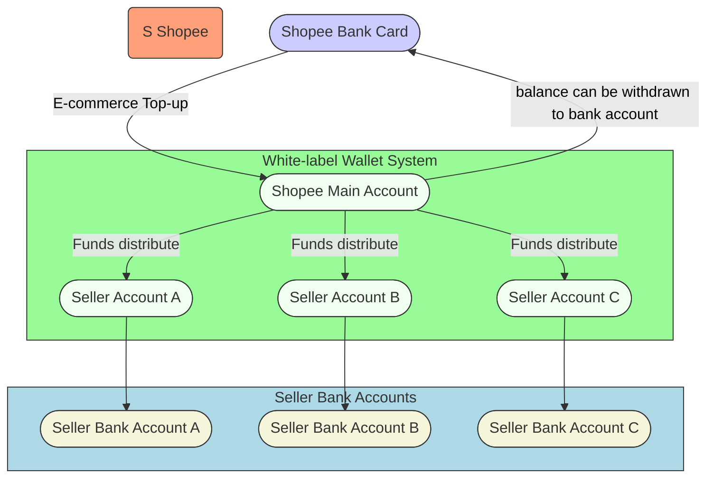

# Data Warehouse Solutions

> 🛡️ **Disclaimer:**  
> The following content represents generalized industry knowledge and anonymized case practices.  
> It does **not contain any confidential, proprietary, or internal information** from any specific company.

---

## 1. Data Warehouse Architecture 

Built a layered data warehouse (ODS > DIL > DML > DAL) to ingest, clean, and transform data into fact and dimension tables. Defined data domains, granularity, metrics, and embedded business logic for subject-oriented, multi-dimensional analysis.

  

## 2. ToC Business - Global Remittances to China

Partner with overseas remittance providers (e.g. Panda Remit, Wise) to bring foreign currency into China  

This diagram provides a basic outline, — the actual **information flow** and **funds flow** is much more complex.

**Subject-Specifc Analysis model**, covering `Sending Institution (Remittance Providers)`, `Orders`, and `Users`.

1. **Remittance Provider** : Analysed key metrics (countries, currencies and transaction, user volumes, fees, FX income ...), produced reports of transaction & profits to guide improvements.
2. **Orders** : 3 stage life-cycle funnel to measure conversion rates and bottleneck. - Order status: A: Provider order | B: Account opening process | C:  Complete fund receipt.
3. **Users** : basic info, behaviour, life-cycle, preferences for targeted campaigns.

| No. | Business Processes  | Description |
|:---:|---------------------|-------------|
| pre 1   | Partner Onboarding  | Partners complete a onboarding process. Risk & compliance teams perform due diligence. |
| pre 2   | Institution Funding | Partners pre-fund a designated account to ensure sufficient liquidity for remittance. |
| pre 3   | Currency Exchange   | Based on settlement needs, foreign currency is converted into RMB. |
| 4   | Remittance Service | End-users initiate remittance via the provider's app by submitting sender and recipient info. 1. If the recipient is new, an SMS prompts setup of a receiving card. 2. The provider calls the remittance API to submit the order. 3. Funds are routed into local settlement accounts. |
| 5   | Payment Collection  | Recipients collect RMB via digital wallets or linked bank-cards. |

## 3. ToB Business - Cross-border E-commerce Collection and Payment

> Background: Under the standard collection model, Shopee currently only supports local settlement of sales proceeds—meaning funds from sold goods can only be settled into local overseas bank accounts. However, for cross-border sellers, it is generally not feasible to open overseas bank accounts due to high entry barriers and operational costs. As a result, sellers face challenges in receiving payments and difficulties in capital circulation.

Provide offshore accounts (Shopee official wallet) and fund repatriation services for Shopee cross-border sellers based in Mainland China, Hong Kong, and South Korea.

| No. | Business Process                    | Description                                                                                  |
|-----|-------------------------------------|----------------------------------------------------------------------------------------------|
| 1   | **Merchant Onboarding**            | Merchant registers on the platform and completes kyc.   |
| 2   | **Merchant Shop Binding**         | Merchant links their shops. |
| 3   | **Funds Inflow (E-commerce Top-up)** | E-commerce Top-up |
| 4   | **Funds Payout (Disbursement & Deduction)** | The platform processes payouts or automatic deductions on behalf of the merchant (e.g. platform fees, commission). |
| 5   | **Merchant Shop Card Binding**          | Merchant binds a settlement bank card for receiving withdrawals.     |
| 6   | **Merchant Operations (e.g., Annual Subscription Plan)** | Merchant performs business-related actions such as purchasing subscription plans or value-added services. |
| 7   | **Withdrawal and Payment**         | Merchant initiates fund withdrawal to their own bank account or makes payments to external suppliers. |

**Subject-Specifc Analysis model**, covering `Merchant`, `Shop`, and `Orders`.

### Merchant Subject Table

> Shopee's official wallet business leverages multi-dimensional data analysis to support merchant lifecycle management, transaction insights, and revenue optimization. From churn monitoring to cross-site transaction trend analysis, comprehensive dashboards and thematic tables provide strong data support for business growth, product experience enhancement, and precision operations.

| Category | Field Name | Data_Type | Description |
|-----------------------------------------|--------------------------------------|-----------|-----------------------------------------------------------------------------|
| **Partition Field**   | fdate                       | BIGINT  | Partition date                                                              |
| **Primary Key**       | fgid                        | STRING  | Merchant GID (Global ID)                                                   |
| **Primary Key**       | fspid                       | STRING  | Merchant SPID (Sub-platform ID)                                            |
| **Merchant Basic Attributes** | fcompany_name       | STRING  | Company name                                                                |
| **Horizontal Time**    | fkyc_first_submit_time          | STRING  | First KYC submission time                                                   |
| **Horizontal Time**    | fkyc_first_approved_time        | STRING  | First KYC approval time                                                     |
| **Horizontal Time** | fshop_apply_time                   | STRING  | Store application time                                                      |
| **Horizontal Time** | fshop_first_bind_time              | STRING  | First store binding time                                                    |
| **Horizontal Time** | fcard_first_bind_time              | STRING  | First card binding time                                                     |
| **Horizontal Time** | ffirst_disbursement_time           | STRING  | First disbursement time (funds distributed on behalf of merchant)          |
| **Horizontal Time** | ffirst_withdraw_time               | STRING  | First withdrawal to merchant bank account                                  |
| **Horizontal Time** | ffirst_payment_time                | STRING  | First payment to external supplier                                         |
| **Horizontal Time** | fsubs_plan_first_buy_time          | STRING  | First annual plan purchase time                                             |
| **Horizontal Time** | fsubs_plan_first_use_time          | STRING  | First annual plan usage time                                                |
| **Vertical - Tag** | fsite_count                    | BIGINT  | Number of sites (e.g., Shopee-TW, Shopee-SG)                               |
| **Vertical - Tag** | fshop_count                    | BIGINT  | Number of stores bound to merchant                                         |
| **Vertical - Tag** | faccount_count                 | BIGINT  | Number of accounts under this merchant                                     |
| **Vertical - Tag** | fpayee_count                   | BIGINT  | Unique payee count (withdrawal or supplier payments)                       |
| **Vertical - Tag** | fpayee_count_30d               | BIGINT  | Payee count in the last 30 days                                            |
| **Vertical - Statistical** | ftrd_cnt_month                 | BIGINT  | Total transaction count this month                                         |
| **Vertical - Statistical** | ftrd_cnt_year                  | BIGINT  | Total transaction count this year                                          |
| **Vertical - Statistical** | flast_disbursement_amount_cny_1d    | DOUBLE    | Disbursement amount in CNY (today)                                         |
| **Vertical - Statistical** | flast_disbursement_amount_usd_1d    | DOUBLE    | Disbursement amount in USD (today)                                         |
| **Vertical - Statistical** | flast_disbursement_amount_cny_28d   | DOUBLE    | Disbursement amount in CNY (last 28 days)                                  |
| **Vertical - Statistical** | flast_disbursement_amount_usd_28d   | DOUBLE    | Disbursement amount in USD (last 28 days)                                  |
| **Vertical - Statistical** | ftrd_amt_month                      | DOUBLE    | Total transaction amount this month                                        |
| **Vertical - Statistical** | ftrd_amt_year                       | DOUBLE    | Total transaction amount this year                                         |
| **Vertical - Statistical** | fmax_trd_amt_month                  | DOUBLE    | Max single transaction amount this month                                   |
| **Vertical - Statistical** | fmax_trd_amt_year                   | DOUBLE    | Max single transaction amount this year                                    |
| **Lifecycle Tag** | fmerchant_lifecycle_tag   | BIGINT | Merchant lifecycle status tag: 1. Not disbursed 2. New 3. Retained 4. Lost 5. Recovered 0. Default |
